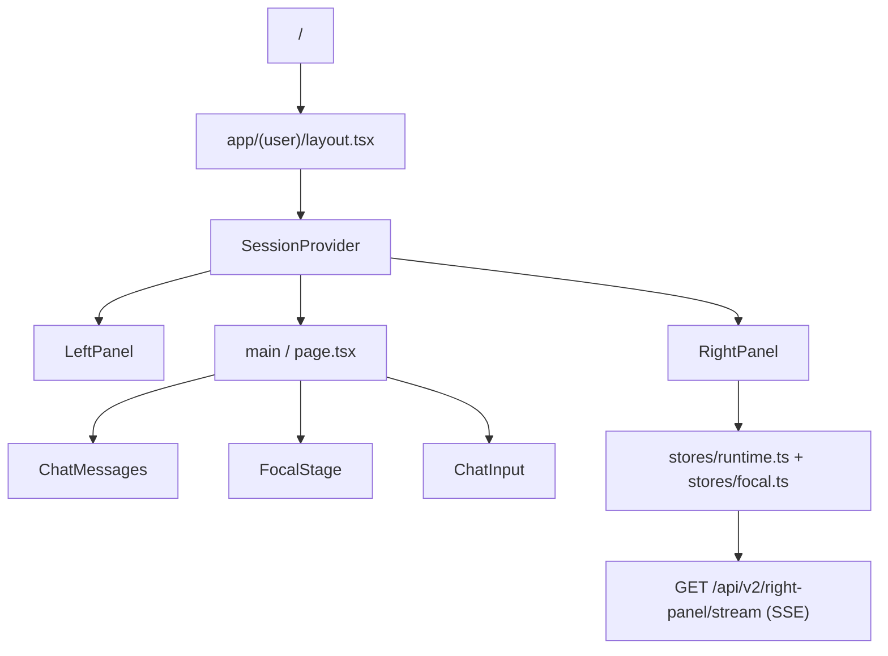

# Hearst OS

Système d'action centré chat avec orchestration v2, artifacts file-backed, et missions récurrentes.

**UI — Ghost Protocol (26/04/2026)** : surface cockpit sombre (`app/globals.css` tokens), typographie Satoshi + Geist Mono, séparateurs `var(--line)`, glyphes SVG filaires (`app/(user)/components/ghost-icons.tsx`), intégrations affichées en `ServiceIdGlyph` (plus d’emojis dans l’UI). Classes utilitaires Ghost (`.ghost-meta-label`, `.ghost-btn-solid`, modales, skeleton scanline) et `.status-dot*` (`box-shadow: none`) sont définies dans `app/globals.css` et couvertes par `__tests__/ui/design-tokens.test.ts`. **Admin** (`app/admin/*`, `app/components/AdminSidebar.tsx`) aligné sur les mêmes variables (remplacement massif des tons `zinc-*` / boutons primaires).

> 🚀 **Quick Start**: `npm run dev` = **hearst-os seul** sur **:9000**  
> `npm run launch` = stack complète + nohup + purge `.next`  
> 📖 Guide complet: [`LAUNCHER.md`](./LAUNCHER.md)

> **🆕 Mise à jour 26/04/2026 — Cleanup complet terminé** :  
> ✅ 30+ fichiers morts supprimés  
> ✅ Shims `lib/planner/` et `lib/orchestrator/` nettoyés  
> ✅ Nango configuré (200+ OAuth providers)  
> ✅ 407 tests pass • Build ✅ • TypeScript 0 erreur
>
> **🆕 Mise à jour 26/04/2026 — Capability-First Runtime** :  
> ✅ Taxonomie centralisée (`lib/capabilities/taxonomy.ts`) — domaines, capabilities, tools, agents  
> ✅ Capability Router (`lib/capabilities/router.ts`) — résolution unifiée domaine/mode/providers  
> ✅ Capability Guard hard block dans `delegate()` — `PERMISSION_DENIED` si agent hors domaine  
> ✅ Planner contraint — `step.agent` validé contre taxonomie, remappé si invalide  
> ✅ Heuristiques spécialisées remplacées par routage domain-first (`DOMAIN_AGENT_ROUTES`)  
> ✅ `detectRetrievalMode` supprimé — remplacé par `resolveRetrievalMode` (taxonomie)  
> ✅ `execution-mode-selector.ts` + `types/execution-mode.ts` supprimés — remplacés par `resolveExecutionMode` (router)  
> ✅ Provider preflight unifié via `scopeRequiresProviders(capScope)`  
> ✅ Keywords dédupliquées : `resolveDataIntent` centralisé, `isXTask` supprimés du pipeline  
> ✅ Exports morts nettoyés : `getRetrievalModeForDomain`, `isXTask` dans barrel  
> ✅ Suite intégration runtime capability-first : `__tests__/runtime/capability-runtime-integration.test.ts` (router, guard, planner mock, `delegate()`, backend v2, providers, contrat SSE)  
> ✅ 491 tests passent (0 régression)

> ✅ **Phase 1 — V2 Foundation TERMINÉE (23/04/2026)**  
> Legacy supprimé : `app/api/chat/route.ts`, `lib/orchestrator.ts`, `app/lib/missions/*`  
> Structure V2 créée : `lib/agents/backend-v2/`, `lib/agents/sessions/`

> ✅ **Backend V2 — Multi-Provider TERMINÉ (24/04/2026)**  
> 5 backends unifiés • 384 tests • 98.3% pass rate  
> [`lib/orchestrator/orchestrate-v2.ts`](./lib/orchestrator/orchestrate-v2.ts)

> ✅ **Fondations — Semaines 0-6 TERMINÉES (25/04/2026)**  
> Sécurité env • Responsive shell • Toasts/feedback • Login FR • Core types unifiés • Analytics 4 events • E2E complet (mobile+desktop)  
> [`docs/CONVERGENCE_STATUS_2026-04-25.md`](./docs/CONVERGENCE_STATUS_2026-04-25.md)

> ✅ **Phase 7 — Convergence Architecture** — **Terminé 25/04/2026**  
> Runtime migré (52 fichiers) • Settings dynamiques (4 fichiers + SQL) • Auth réorganisé • 404 tests ✅

> ✅ **Phase 8.0 — Infrastructure (scale)** — `lib/engine/runtime/assets/storage/` (local, R2, hybrid) • `scripts/migrate-assets.ts` • `lib/connectors/packs/` (loader, `finance-pack` + Stripe) — **Terminé 25/04/2026**

> ✅ **Phase A — Connector Router** — `lib/connectors/router.ts` • Routing Pack-first (Stripe) • Fallback Nango • Stats + diagnostics — **Terminé 25/04/2026**
>
> ✅ **Phase B — Finance Agent** — `lib/agents/specialized/finance.ts` • Stripe Agent (list/get payments, invoices, subscriptions, balance, customers, summarize) • Router integration — **Terminé 25/04/2026**
>
> ✅ **Phase 9 — Architecture Finale Alignment** — Structure réorganisée et alignée sur `HEARST-ARCHITECTURE-FINALE.html`
> - `lib/agents/specialized/` — Agents métier (finance.ts)
> - `lib/agents/index.ts` — Barrel export restauré
> - `lib/connectors/packs/finance-pack/{auth,services,mappers,schemas}/` — Connector Pack structure
> - `lib/engine/runtime/assets/{generators,cache,cleanup,api}/` — Asset subsystems
> - `lib/admin/{settings,permissions,connectors,health,audit}.ts` — Admin API complets
> - `lib/platform/db/{supabase,schema,index}.ts` — Database layer
>
> ✅ **Phase 10 — Connector Packs Expansion** — 5 Packs avec services complets
> - `finance-pack/` — Stripe (payments, invoices, subscriptions, balance, customers)
> - `crm-pack/` — HubSpot (contacts, companies, deals), Salesforce (planned)
> - `productivity-pack/` — Notion (pages, databases, blocks, search), Trello/Asana (planned)
> - `design-pack/` — Figma (files, components, variables, comments), Adobe/Canva (planned)
> - `developer-pack/` — GitHub (repos, PRs, issues, commits) — ✅ **Phase 4**
>
> **Spec produit / système** : [`docs/PRODUCT_SYSTEM_SPEC.md`](./docs/PRODUCT_SYSTEM_SPEC.md)
> **État Phase 10** : [`docs/STATUS_2026-04-25_PHASE10.md`](./docs/STATUS_2026-04-25_PHASE10.md)
> **État d'avancement / écarts** : [`docs/CONVERGENCE_STATUS_2026-04-25.md`](./docs/CONVERGENCE_STATUS_2026-04-25.md)
>
> **Métriques actuelles (26/04/2026)** :
> | Métrique | Valeur |
> |----------|--------|
> | Fichiers TypeScript | 274 lib/ + 63 app/ = **337 total** |
> | Tests | **407 pass** (35 fichiers) |
> | Build | ✅ **Succès** |
> | TypeScript | ✅ **0 erreur** |
> | Code mort | ✅ **Supprimé** (30+ fichiers) |
> | Connector Packs | **5** (finance, crm, productivity, design, developer) |
> | Specialized Agents | **5** (finance, crm, productivity, design, developer) |
> | OAuth Providers | **200+** via Nango |
>
> **Phase 0–5 + UI Improvements COMPLÈTES (26/04/2026)**:
> - **Phase 0-4** — Infrastructure alignment + Admin APIs + Platform settings + Agents capabilities
> - **Priorité 2-5** — Planner stubs → Real API calls + Stripe OAuth + Redis cache + Structure refactor
> - **Corrections finales** — Barrel export exhaustif, Vrai LRU cache, Types Asset unifiés
> 
> **UI Improvements (26/04/2026)**:
> - ✅ **OAuth Connectors** — Flow fonctionnel avec Nango SDK popup (@nangohq/frontend)
> - ✅ **Assets Liste** — Page `/assets` découvrable avec search, filtres, pagination
> - ✅ **Error Handling** — Remplacement alerts par système toast unifié
> - ✅ **Security** — Validation stricte NEXT_PUBLIC_NANGO_PUBLIC_KEY (pas de fallback secret key)
>
> **Documentation audits** : 3 rapports détaillés (2,267 lignes) — [`docs/AUDIT_PRIORITIES_2_3.md`](./docs/AUDIT_PRIORITIES_2_3.md), [`docs/AUDIT_PRIORITIES_2_5_COMPLETE.md`](./docs/AUDIT_PRIORITIES_2_5_COMPLETE.md), [`docs/AUDIT_FINAL_CORRECTIONS.md`](./docs/AUDIT_FINAL_CORRECTIONS.md)

## 📚 Documentation Architecture (HTML)

Documents interactifs ouverts dans le navigateur :

| Document | Contenu | Lien |
|----------|---------|------|
| **HEARST-ARCHITECTURE-FINALE.html** | Structure complète `lib/` après audit 100%. Où mettre les assets, services, admin. | [`./HEARST-ARCHITECTURE-FINALE.html`](./HEARST-ARCHITECTURE-FINALE.html) |
| **HEARST-MASTERPLAN.html** | Vision produit, roadmap 19 semaines, investissements infrastructure | [`./HEARST-MASTERPLAN.html`](./HEARST-MASTERPLAN.html) |
| **hearst-ui-vision.html** | Interface utilisateur — 2 états (IDLE/ACTIVE), chat-first, assets, missions | [`./hearst-ui-vision.html`](./hearst-ui-vision.html) |
| **HEARST-STATUS-VS-VISION.html** | Vue simple et visuelle: état réel, vision cible, écarts, prochaines étapes | [`./HEARST-STATUS-VS-VISION.html`](./HEARST-STATUS-VS-VISION.html) |

**Ouvrir :** `open HEARST-ARCHITECTURE-FINALE.html` (ou double-clic)

### Documentation Technique (Markdown)

| Document | Contenu |
|----------|---------|
| [`LAUNCHER.md`](./LAUNCHER.md) | Guide démarrage — `npm run launch` |
| [`docs/PRODUCT_SYSTEM_SPEC.md`](./docs/PRODUCT_SYSTEM_SPEC.md) | Spec produit / système complet |
| [`docs/CONVERGENCE_STATUS_2026-04-24.md`](./docs/CONVERGENCE_STATUS_2026-04-24.md) | Etat réel du projet: fait, restant, écarts, ordre recommandé |
| [`docs/AGENT_GOVERNANCE.md`](./docs/AGENT_GOVERNANCE.md) | Gouvernance outils & lifecycle agents |
| [`docs/DOMAIN_MODEL.md`](./docs/DOMAIN_MODEL.md) | Modèle de données (Entity Map) |
| [`docs/RUNTIME_AND_REPLAY.md`](./docs/RUNTIME_AND_REPLAY.md) | Cycle de vie runs & replay |
| [`docs/DB_AND_MIGRATIONS.md`](./docs/DB_AND_MIGRATIONS.md) | Database & migrations |
| [`docs/NANGO_SETUP.md`](./docs/NANGO_SETUP.md) | Setup OAuth Nango

### Core Types — Architecture Finale

| Module | Path | Description |
|--------|------|-------------|
| `lib/core/types` | [`./lib/core/types/index.ts`](./lib/core/types/index.ts) | **Point d'entrée canonique** pour les types métier centraux. Barrel export unifié aligné sur Architecture Finale. |
| `lib/core/types/focal` | [`./lib/core/types/focal.ts`](./lib/core/types/focal.ts) | Utilities focal (mapFocalObject, mapFocalObjects) — unification client/serveur. |

**Migration** : nouveaux imports depuis `@/lib/core/types` (unifié) plutôt que dispersés. Legacy supporté avec marquage @deprecated.

**Architecture Finale alignment** : [`ROADMAP_ARCHITECTURE_FINALE.md`](./ROADMAP_ARCHITECTURE_FINALE.md) — plan de convergence vers la structure cible (lib/platform/, lib/engine/, lib/agents/, connector packs).

## Architecture UX

- **Chat-first shell** (`ChatInput` + `ChatMessages`) — Input fixe en bas, conversation thread-scopée. Chat toujours visible, focal toggleable au-dessus.
- **Surface centrale principale** (`FocalStage` dans `app/(user)/page.tsx`) — Quand un objet focal existe, il devient la **surface de lecture principale** au centre. Chat contextuel en bas.
- **Rail droit compact** (`RightPanel`) — Surface de confiance scannable : runtime, focal compact (titre + statut + action), secondaires en liste. Pas de lecture longue.
- **Navigation gauche** (`LeftPanel`) — Mémoire des threads uniquement. Navigation chat-first.
- **Momentum** — *Cible non montée* — rappel discret des activités. `TopContextBar` et `MomentumIndicator` sont des cibles de convergence.
- **Surfaces** : `/` (home) — entrée chat-first. Routes legacy accessibles mais non exposées.
- Layout user : `LeftPanel` (threads) + zone centrale (`main` avec chat + FocalStage toggleable) + `RightPanel` (index/confiance)

### Tokens (source `app/globals.css`)

Modèle d'élévation (du plus profond au plus clair) : **rail < background < surface**. Les panels sont *lifted* au-dessus du canvas pour être visibles sans OLED.

| Token | Var CSS | Hex | Usage |
|-------|---------|-----|-------|
| `bg-rail` | `--rail` | `#0c0c10` | Rail admin — `app/components/Sidebar.tsx` (`/admin/*`) |
| `bg-background` | `--background` | `#09090b` | Canvas — `body` (`app/layout.tsx`), `/login` |
| `bg-surface` | `--surface` | `#14141a` | Panels lifted — `LeftPanel`, barre d'input `ChatInput` |
| `bg-cyan-accent` / `text-cyan-accent` | `--cyan-accent` | `#00e5ff` | Accent unique (focal, dot connecté, divider) |
| `--glow-cyan-{sm,md,core,soft,dot}` | — | rgba(0,229,255,…) | Halos centralisés — **ne pas dupliquer en `rgba` dans les composants** |

Garde-fou : `__tests__/ui/design-tokens.test.ts` valide la présence de tous ces tokens dans `app/globals.css` et dans le bloc `@theme inline`.

#### Guide de style — surfaces actuelles

- **Surface centrale** (`FocalStage`) — pas de coque verre, le document respire directement sur le fond canvas.
- **Rail droit** (`RightPanel`) — aligné sur le canvas (`bg-background`), pas de `ghost-side-panel`.
- **État focal** — partagé via `stores/focal.ts` (Zustand), pas de provider React dédié actuellement.

> Note : la palette `bg-zinc-{800,900,950}` reste utilisée volontairement dans `app/admin/*` et certaines pages `app/(user)/*` pour les **élévations multi-niveaux** (cartes, inputs, hovers, code blocks). Ces niveaux ne sont pas couverts par les 3 tokens canoniques ci-dessus.

#### Piège HMR connu — éditer `app/globals.css`

Next 16 + Turbopack peuvent garder en cache l'ancien contenu de `app/globals.css` après une édition de variables CSS dans `:root` ou `@theme`. Symptôme : le source contient `#050505` mais le navigateur sert encore `#000`. Ni `touch` ni hard reload ne suffisent.

Toujours faire après une édition de tokens :

```bash
npm run dev:fresh   # kill port 9000 + rm -rf .next + npm run dev
```

Vérification rapide depuis un terminal :

```bash
CSS=$(curl -s http://localhost:9000/login | grep -oE '/_next/static[^"]+\.css' | head -1)
curl -s "http://localhost:9000${CSS}" | grep -oE '\-\-(surface|background|rail|cyan-accent):[^;}]+' | sort -u
```

Les valeurs retournées doivent matcher exactement la table ci-dessus.

## Canonical UI Work Map

### Never Guess The Surface

Si un agent doit modifier l'UI HEARST OS, il doit partir de la chaîne réelle de rendu, pas d'une maquette statique.



### Work Here — Chaîne de rendu réelle

- **Centre home `/`** : `app/(user)/page.tsx` — `ChatMessages` (conversation), `FocalStage` (toggleable, surface principale quand focal existe), `ChatInput` (contextuel). Rehydrate via `stores/focal.ts`.
- **Shell user** : `app/(user)/layout.tsx` — `LeftPanel` + `main` + `RightPanel`.
- **Sidebar gauche** : `app/(user)/components/LeftPanel.tsx` — threads, mémoire de conversation.
- **Chat** : `app/(user)/components/ChatMessages.tsx` + `ChatInput.tsx` — toujours visible, contextuel quand focal présent.
- **Surface centrale** : `app/(user)/components/FocalStage.tsx` — lecture principale du document focal.
- **Rail droit** : `app/(user)/components/RightPanel.tsx` — index/confiance, focal compact, runtime status.
- **État** : `stores/focal.ts` + `stores/runtime.ts` + `stores/navigation.ts` (Zustand, pas de providers React).
- **Détail run** : `app/(user)/runs/[id]/page.tsx` — timeline canonique.

### Do Not Work Here Unless Explicitly Asked

- maquettes HTML standalone
- fichiers de preview non branchés
- captures, prototypes, snippets jetables
- code runtime/orchestrator si la demande est purement visuelle

### Why Agents Get Confused

- `FocalStage` est la surface centrale principale quand un objet focal existe ; il consomme `stores/focal.ts` (Zustand) partagé avec le RightPanel
- `RightPanel` dépend d'un thread actif et du flux SSE `GET /api/v2/right-panel/stream` (event `panel`, ~1s), même contrat que `GET /api/v2/right-panel`
- `RightPanel` est masqué sous le breakpoint `lg`
- l'écran `/` passe d'abord par le shell authentifié, donc modifier un composant hors de cette chaîne ne change rien de visible

### Fast Validation Checklist

Avant toute conclusion du type "ça ne change pas", vérifier:

1. que le fichier modifié est bien dans la chaîne ci-dessus
2. que l'on teste la vraie route `/`
3. que la session est authentifiée
4. que la fenêtre est assez large pour afficher `RightPanel`
5. qu'on ne travaille pas sur une maquette hors circuit

### Anti-Mistake Rule

Si un agent ne peut pas relier visuellement un changement à `app/(user)/layout.tsx` ou à l'un des composants directement rendus depuis cette chaîne, il doit considérer qu'il est probablement en train d'éditer la mauvaise surface.

## Comportement produit

- **V2 Runtime** canonique — fallback V1 legacy explicite conservé pour usage non-chat ou migration.
- **Missions** : créées depuis le chat (CTA après report réussi) ou Right Panel. Composer inline, schedule presets, Run Now, toggle enable/disable.
- **Artifacts** : file-backed — PDF (pdfkit), XLSX (exceljs), markdown, JSON, CSV. Download via `/api/v2/assets/{id}/download`.
- **Connectors** : direct activation OAuth (Google, Slack). Vérité unifiée via `GET /api/v2/user/connections`.
- **Timeline** : observable dans le Right Panel, événements persistés via `/api/v2/runs/{id}`.
- **Inbox** : priorisation rule-based (urgent/normal/low), zéro LLM.

### Thread ↔ Conversation ↔ Focal — Contrat canonique chat-first

Sur la home `/` (chat-first), la continuité repose sur `thread_id` comme clé unique:

- **`thread_id === conversation_id`** — Canonique actuelle sur `/`. Les deux IDs sont identiques pour assurer la continuité sans ambiguïté.
- **Historique borné** — ~10 derniers messages user/assistant sont envoyés à `/api/orchestrate` pour le contexte LLM. Si absent, rechargé depuis `lib/memory/store.ts`.
- **Persistance mémoire** — Messages persistés via `appendMessage()` dans `lib/memory/store.ts` sous la même clé canonique, scoped par tenant.
- **Session seeding** — Les sessions OpenAI (Assistants et Responses) sont initialisées avec `initialHistory` pour rejouer le contexte dans une session fraîche.
- **Focal/assets durable** — Le focal et les assets restent durables par `thread_id`, réhydratés depuis `/api/v2/right-panel` au changement de thread ou au reload.
- **Pas de bleed** — Nouveau thread = nouvelle session mémoire vide, pas de contexte de l'ancien thread.

**Note**: `/api/conversations` existe mais n'est pas encore la source canonique de la home chat-first. Le contrat actuel est `thread_id === conversation_id`.

### Approvals et États d'attente — Nomenclature canonique

Le système utilise une nomenclature unifiée pour les états d'attente:

- **`awaiting_approval`** — État canonique pour "validation requise". Émis via `approval_requested` ou `run_suspended` avec `reason: "awaiting_approval"`.
- **`awaiting_clarification`** — État canonique pour "précision requise". Émis via `clarification_requested` ou `run_suspended` avec `reason: "awaiting_clarification"`.

**Règles**:
- Le runtime (`stores/runtime.ts`) mappe ces événements vers `coreState` et `flowLabel`.
- Le RightPanel affiche des labels lisibles (amber pour approval, violet pour clarification) au lieu de l'état brut.
- La page run continue le polling tant que le run est dans un état live (running, awaiting_approval, awaiting_clarification).
- Les anciens wordings type `waiting_approval` sont legacy/conceptuels — le canonique est `awaiting_approval`.

**Note**: Cette étape unifie la narration d'état.

### Narration Focale Canonique — Plan / Mission / Asset

`/api/v2/right-panel` est la source canonique de narration focale thread-scopée. La résolution n'est plus "asset-only" mais prend en compte la chaîne complète:

**Priorité de résolution focale** (implémentée dans `lib/right-panel/manifestation.ts:resolveFocalObject()`):
1. **Plan en `awaiting_approval`** — Message draft, mission draft, watcher draft
2. **Plan en exécution avec output visible** — Outline (pré-report en génération)
3. **Latest asset** — Report, brief, message receipt
4. **Mission active** — Mission active ou watcher active
5. **Idle** — Aucun focal

**Métadonnées conservées** (client et API):
- `threadId` — Traçabilité thread-scopée
- `sourcePlanId` — Lien vers le plan d'origine (si applicable)
- `sourceAssetId` — Lien vers l'asset d'origine (si applicable)
- `morphTarget` — Cible de transformation possible (ex: `message_draft` → `message_receipt`)
- `primaryAction` — Action primaire affichable (approve/discard/pause/resume)

**Architecture**:
- `lib/right-panel/manifestation.ts` — Logique de manifestation (plan/mission/asset → focal)
- `lib/ui/right-panel/aggregate.ts` — Résolution canonique côté API
- `stores/focal.ts` — Store client avec métadonnées enrichies
- `FocalStage.tsx` — Rendu enrichi avec status, provenance, action primaire
- `RightPanel.tsx` — Surface primaire focal + historique secondaire compact

**Actions primaires opérantes**:
- `approve` — Approuve un plan en `awaiting_approval` et reprend l'exécution
- `pause` — Met en pause une mission/watcher active
- `resume` — Reprend une mission/watcher en pause
- **`retry`** — Réessaie un focal en statut `failed` (mission ou plan/run)

**API endpoints**:
- `POST /api/v2/plans/[id]/approve` — Approuve et exécute un plan
- `POST /api/v2/missions/[id]/pause` — Met en pause une mission
- `POST /api/v2/missions/[id]/resume` — Reprend une mission
- **`POST /api/v2/missions/[id]/run`** — Relance une mission (retry)
- **`POST /api/orchestrate`** — Relance un plan/run (retry avec message "Reprends depuis la dernière erreur") ; réponse **SSE** — le client lit le flux jusqu’à `run_failed` ou fin de stream (`lib/orchestrator/consume-sse-response.ts`)

**Implémentation**:
- `focal_context` sur `/api/orchestrate` : `{ id, objectType, title, status }` (aligné route `app/api/orchestrate`)
- `FocalStage.tsx` et `RightPanel.tsx` appellent les APIs via `fetch()`
- **`FocalRetryButton`** — Composant partagé pour actions retry (mission vs orchestrate)
- **Manifestation automatique** — `augmentWithRetryAction()` ajoute `primaryAction.kind = "retry"` aux focaux `status === "failed"`
- Les identifiants canoniques (`sourcePlanId`, `missionId`, `threadId`) sont portés par le contrat focal
- Refresh automatique du RightPanel après succès
- États de loading et erreur gérés côté client
- Le centre (`FocalStage`) et le RightPanel consomment le même contrat enrichi via `/api/v2/right-panel`

### Contrat Run ID Canonique (Chat V2)

**Principe**: Un seul `run_id` user-facing pour tout le flux chat-first V2 — client et backend alignés.

**Flow**:
1. Client initie avec un `client_token` (temporaire, pour correlation)
2. Backend génère le `run_id` canonique (`run_${timestamp}_${counter}`)
3. Backend émet `run_started` avec ce `run_id` dès le début
4. Client capture ce `run_id` et l'utilise pour tous les events suivants
5. Tous les events SSE portent le même `run_id` canonique
6. L'API `/api/v2/runs/[id]` expose ce même identifiant

**Logs de cohérence**:
- `[RuntimeStore]` logue les transitions de run_id (client → canonique)
- `[RuntimeStore]` warning si un event arrive avec un run_id différent du courant
- `[Chat]` logue le run_id canonique établi et final

**Résolution d'IDs**:
- `client_token` (`client-${Date.now()}`) → temporaire, remplacé par le canonique
- `run_id` canonique (`run_${ts}_${n}`) → utilisé partout (SSE, store, API)
- `dbRunId` → identique au `run_id` canonique pour correlation directe

### Connecteurs Réels — Flow OAuth Nango

**Architecture**:
- Source canonique: `/api/v2/user/connections` — retourne les statuts réels depuis control-plane + user_tokens
- OAuth flow: Nango SDK (backend) + redirection frontend
- Callback: `/api/nango/callback` → redirige vers `/apps`

**APIs**:
- `GET /api/v2/user/connections` — Liste des services avec statut de connexion
- `POST /api/nango/connect` — Initie le flow OAuth (retourne config pour frontend)
- `GET /api/nango/callback` — Callback OAuth, sync vers control-plane, redirect vers `/apps`

**Flow complet**:
1. User clique "Connecter" sur App Hub ou bannière
2. Frontend appelle `POST /api/nango/connect` avec le provider
3. Backend génère `connectionId` et retourne la config Nango
4. Frontend redirige vers `/apps?connecting={serviceId}` (préparation pour popup SDK)
5. OAuth popup s'ouvre avec Nango (à implémenter avec `@nangohq/frontend`)
6. Nango callback → backend sync → redirect vers `/apps?connected={provider}`
7. Frontend recharge les connexions via `/api/v2/user/connections`

**État des connecteurs**:
- `lib/integrations/catalog.ts:enrichWithConnectionStatus()` — fetch côté client, reconciler côté serveur
- `stores` et composants reçoivent les vrais statuts (`connected`, `pending`, `error`, `disconnected`)
- Les @mentions dans ChatInput sont filtrées sur les services réellement connectés
- CapabilityTabs s'affiche uniquement si les services correspondants sont connectés

**Logs backend**:
- `[UserConnections] User xxx: N/M connected` — Chargement des connexions
- `[NangoConnect] Initiating OAuth: {provider}` — Début flow OAuth
- `[NangoCallback] Connection synced: {provider}` — Succès OAuth + sync control-plane

### Design System — Halo Phase 1

**North star**: `halo-design-direction.html` — cockpit premium avec surfaces profondes, accents cyan maîtrisés, typographie éditoriale.

**Tokens CSS** (`app/globals.css`):
```css
/* Surfaces — hiérarchie profonde */
--bg: #0a0a0b        /* Primary background */
--bg-elev: #111114    /* Elevated surfaces */
--bg-soft: #16161a    /* Cards, inputs */
--rail: #0c0c10      /* Side panels */

/* Text — échelle d'opacité */
--text: rgba(255,255,255,0.9)       /* Titres */
--text-soft: rgba(255,255,255,0.55) /* Body */
--text-muted: rgba(255,255,255,0.32)/* Meta */
--text-faint: rgba(255,255,255,0.18)/* Labels */

/* Accents */
--cykan: #00e5ff      /* Cyan primaire */
--money: #4ade80      /* Succès, positif */
--warn: #fbbf24       /* Attention */
--danger: #ef4444     /* Erreur */

/* Bordures */
--line: rgba(255,255,255,0.06)       /* Bordures standard */
--line-strong: rgba(255,255,255,0.12)/* Bordures focus */

/* Glows */
--glow-cyan-sm: 0 0 4px rgba(0, 229, 255, 0.3)
--glow-cyan-md: 0 0 8px rgba(0, 229, 255, 0.4)
```

**Utilitaires typographiques**:
- `.halo-title-xl` (56px, bold, tight tracking) — Valeurs principales
- `.halo-title-lg` (24px, light) — Titres focaux
- `.halo-title-md` (18px, semibold) — Sous-titres
- `.halo-mono-label` (9px, uppercase, letter-spacing 0.18em) — Labels de section
- `.halo-mono-tag` (10px, uppercase) — Tags, statuts
- `.halo-mono-meta` (11px) — Métadonnées
- `.halo-body` (13px, leading 1.6) — Contenu principal

**Composants Halo**:
- `.halo-card` — Surface carte avec bordure
- `.halo-active` — État actif avec accent cyan
- `.halo-progress` — Barre de progression avec glow
- `.halo-command-bar` — Barre de commande avec backdrop blur
- `.halo-idle-glow` — Effet de halo pour états vides

### Architecture Runtime — Convergence V2 Canonique

**Principe**: Une seule stack runtime pour le chat-first user-facing. V2 est le chemin canonique, V1 est legacy explicite.

**Chemin canonique**:
```
/api/orchestrate (POST)
  └── lib/orchestrator/entry.ts::orchestrateV2()
      ├── V2 canonique (défaut) → lib/orchestrator/orchestrate-v2.ts
      │   ├── SessionManager + Backend Selector
      │   ├── Run lifecycle (run_started → text_delta → run_completed)
      │   ├── Timeline persistence
      │   ├── Asset generation + Focal narration
      │   ├── Schedule detection → missions
      │   └── Approvals/Clarification states
      └── V1 legacy (fallback explicite) → lib/orchestrator/index.ts
          └── Pour usage non-chat ou migration
```

**Routing** (`lib/engine/orchestrator/entry.ts`):
- Unified orchestrator: all requests go through the capability-first runtime.
- `resolveCapabilityScope()` → domain/capability/provider resolution.
- `resolveExecutionMode()` → maps scope to execution mode (direct_answer, workflow, custom_agent, managed_agent).
- `capabilityGuard()` in `delegate()` → hard block (PERMISSION_DENIED) if agent is out-of-domain.
- Planner validation: `step.agent` checked against taxonomy, remapped to valid agent if needed.
- Dead code removed: `execution-mode-selector.ts`, `types/execution-mode.ts`, `detectRetrievalMode`, `buildExecutionContext`.

**État de convergence**:
| Feature | V2 Canonique | V1 Legacy |
|---------|--------------|-----------|
| Session Manager + Multi-backend | ✅ | ❌ |
| Run lifecycle SSE | ✅ | ✅ |
| Timeline persistence | ✅ | ✅ |
| Focal narration (asset → plan/mission) | ✅ | ✅ |
| Schedule detection | ✅ | ✅ |
| Mission linkage | ✅ | ✅ |
| Approvals/Clarification | ✅ | ✅ |
| Research reports | ❌ (roadmap) | ✅ |
| Synthetic retrieval | ❌ (roadmap) | ✅ |

**Logs backend**:
- `[Orchestrator] Canonical V2 path for user xxx` — Routing V2
- `[Orchestrator] Fallback to V1 for user xxx` — Routing legacy
- `[Orchestrator] Explicit legacy V1 requested` — Opt-out explicite

### Sécurité & Scope — Hardening V2

**Principe**: Toutes les routes `/api/v2/*` user-facing sont protégées par auth et scopées au user/tenant/workspace courant.

**Architecture**:
```
proxy.ts (Next.js 16 Proxy)
├── Garde global auth — toutes les routes
├── Public paths exemptées (/login, /api/auth, /api/health, /api/webhooks)
├── Auth par: session cookie | API key (x-api-key) | dev bypass explicite
└── API routes: 401 si non autorisé

lib/scope.ts (Canonical Scope Resolution)
├── resolveScope() → { userId, tenantId, workspaceId, isDevFallback }
├── requireScope() → scope ou { error }
├── Dev fallback: explicite et loggé uniquement
└── Future: HEARST_TENANT_ID / HEARST_WORKSPACE_ID env pour multi-tenant explicite

Routes V2 scopées
├── GET /api/v2/runs — filtré par userId (DB + in-memory)
├── GET /api/v2/runs/[id] — vérification ownership (userId match)
├── GET /api/v2/missions — filtré par userId/tenant/workspace
├── POST /api/v2/missions — créé avec scope courant
├── PATCH/DELETE /api/v2/missions/[id] — vérification ownership
├── POST /api/v2/missions/[id]/run — vérification ownership
├── GET /api/v2/assets — filtré par tenant/workspace + user metadata
├── POST /api/v2/assets — créé avec scope courant
├── GET /api/v2/user/connections — scoped au user courant
├── GET /api/v2/right-panel — scoped (via buildRightPanelData)
└── GET /api/v2/right-panel/stream — SSE live (event `panel`, ping keep-alive)
```

**Logs de sécurité**:
- `[Proxy] Unauthorized API access — /api/v2/xxx` — Rejet auth
- `[Proxy] Dev bypass active — /api/v2/xxx` — Bypass explicite
- `[Scope] Dev fallback used — tenant: xxx, workspace: yyy` — Fallback loggé
- `[Scope] Auth failed — no userId` — Session invalide
- `[v2/runs/xxx] Access denied — user mismatch` — Tentative accès non autorisé

**Fallbacks dev restants (documentés)**:
| Variable | Valeur | Usage |
|----------|--------|-------|
| `HEARST_DEV_AUTH_BYPASS=1` | Bypass auth complet | Dev local uniquement |
| `HEARST_TENANT_ID` | Tenant explicite | Multi-tenant futur |
| `HEARST_WORKSPACE_ID` | Workspace explicite | Multi-tenant futur |

**Surfaces mises à jour**:
- `LeftPanel` — Rail avec tokens, active state cyan
- `RightPanel` — Runtime panel avec halo progress bars
- `ChatInput` — Command bar avec glow focus
- `FocalStage` — Hiérarchie typo éditoriale
- `Home idle` — Halo glow background, suggestions chips

## Stack

- **Frontend** : Next.js 16 (App Router), React 19, Tailwind CSS, Geist
- **Backend** : Next.js API Routes, Zod validation, domain layer typé
- **Database** : Supabase (PostgreSQL), types auto-générés, pgvector
- **LLM** : Multi-provider (OpenAI, Anthropic, Composer 2, Gemini 3 Flash), smart routing, fallback `model_profiles`, cost tracking
- **Runtime** : Trace-first, lifecycle canonique, tool governance, replay (live/stub), cost sentinel, prompt guards, output validation
- **Intelligence** : Failure classification, tool/model scoring, drift detection, feedback signals
- **Décisions** : Tool/model selection, fallback intelligent, change tracking, operator surface
- **Deploy** : Vercel (frontend + API), Railway (Docker), standalone output

## 🚀 Setup Rapide

```bash
# 1. Install
cd /Users/adrienbeyondcrypto/Dev/hearst-os
npm install

# 2. Config déjà présente dans .env.local
# ✅ Supabase, Google OAuth, NextAuth, Nango, LLM déjà configurés

# 3. Démarrer
npm run dev
```

## 🔧 Configuration Actuelle (26/04/2026)

| Service | Clé configurée | Statut |
|---------|----------------|--------|
| **Supabase** | `SUPABASE_*` | ✅ Base de données connectée |
| **Google OAuth** | `GOOGLE_CLIENT_ID/SECRET` | ✅ Gmail, Calendar, Drive |
| **NextAuth** | `NEXTAUTH_SECRET` | ✅ Sessions activées |
| **Nango** | `NANGO_SECRET_KEY`, `NEXT_PUBLIC_NANGO_PUBLIC_KEY` | ✅ 200+ OAuth providers |
| **Anthropic** | `ANTHROPIC_API_KEY` | ✅ LLM Claude |
| **Hearst API** | `HEARST_API_KEY` | ✅ Auth interne |
| **Dev Bypass** | `HEARST_DEV_AUTH_BYPASS=1` | ✅ Mode dev simplifié |

## 🌐 Pages UI Accessibles

| Page | URL | Description |
|------|-----|-------------|
| **Home** | `/` | Chat principal avec orchestration |
| **Apps** | `/apps` | Connecteurs OAuth (200+ services) |
| **Missions** | `/missions` | Missions planifiées et récurrentes |
| **Assets** | `/assets` | Fichiers générés (PDF, Excel) |
| **Admin** | `/admin` | Settings, health, audit, connectors |
| **Runs** | `/runs/[id]` | Timeline des exécutions |

## 📁 Scripts Utilitaires

| Script | Usage |
|--------|-------|
| `npm run dev` | Démarre le serveur (:9000) |
| `npm run build` | Build production |
| `npm test` | Lance les 407 tests |
| `npx tsx scripts/verify-all-connections.ts` | Vérifie toutes les connexions |
| `npx tsx scripts/test-nango-github.ts` | Test GitHub via Nango |
| `npx tsx scripts/init-ui-config.ts` | Initialise les settings DB |

# 6. Tests
npm test            # Vitest (LLM, momentum, design tokens, …)
```

## Services et Ports

| Service | Port | Description |
|---------|------|-------------|
| **hearst-os** | `9000` | Frontend principal + orchestration v2 |
| **hearst-connect** | `8100` | Backend de connexion |
| **Hearst-app** | `3000` | Landing page |

**Logs**: `/tmp/hearst-{os,connect,app}.log`

### LLM — providers `composer` / `gemini`

- **Code** : `lib/llm/composer.ts`, `lib/llm/gemini.ts`, enregistrement dans `lib/llm/router.ts` (`getProvider("composer" | "gemini")`). `resetLlmProviderCache()` vide le cache singleton (tests uniquement, export `lib/llm`).
- **Config** : variables dans `.env.example` — `COMPOSER_API_KEY`, `COMPOSER_API_BASE_URL` (OpenAI-compatible `…/v1` + `POST …/chat/completions`), `COMPOSER_AUTH_MODE` (`bearer` \| `basic`) ; `GEMINI_API_KEY`, optionnel `GEMINI_API_BASE_URL` (REST Gemini `generateContent`).
- **Profils Supabase** : migration `supabase/migrations/0018_model_profiles_composer_gemini.sql` — profil tête `composer_2_with_gemini_fallback` (UUID `a1e2f3a4-b5c6-4789-a012-000000000001`) → repli `gemini_3_flash_leaf` (`…000002`). Usage : `chatWithProfile(sb, "<uuid>", messages)` enchaîne les providers selon `fallback_profile_id`.
- **Tests** : `__tests__/llm/router-providers.test.ts` (getProvider + `loadFallbackChain`), `__tests__/llm/providers-http.test.ts` (réponses HTTP mockées), `__tests__/llm/chat-with-profile-composer-gemini.test.ts` (chaîne `chatWithProfile` composer→gemini).

### Momentum — `useMomentum()` / `MomentumIndicator` (cible non montée)

- **Code** : `app/hooks/use-momentum.ts`, modèle pur `app/lib/momentum-model.ts`, UI `MomentumIndicator.tsx` (fichiers existent mais **non montés** actuellement).
- **Statut** : `TopContextBar` et `MomentumIndicator` sont des cibles de convergence future, pas l'état actuel.

## Architecture

### Admin Layer (Phase 0–4)

```
lib/admin/
├── settings.ts              # Settings facade → stores/store.ts (Phase 0B)
├── connectors.ts            # Connectors aligned with DB schema (Phase 0A)
├── permissions.ts           # RBAC user role management
├── health.ts                # System health checks (DB, storage, connectors, LLM)
└── audit.ts                 # Audit log viewer

app/api/admin/
├── _helpers.ts              # Shared auth + RBAC guard (Phase 1)
├── settings/route.ts        # GET/POST settings
├── health/route.ts          # GET health
├── permissions/route.ts     # GET/POST/DELETE permissions
├── audit/route.ts           # GET audit logs
└── connectors/route.ts      # GET/POST/PATCH/DELETE connectors

app/admin/
├── settings/page.tsx        # Feature flags + settings UI (Phase 2)
├── health/page.tsx          # Real-time health dashboard (Phase 2)
└── audit/page.tsx           # Audit log viewer UI (Phase 2)
```

**Phase Summary**:
- **Phase 0A** — `lib/admin/connectors.ts` aligned with real DB schema
- **Phase 0B** — `lib/admin/settings.ts` facade on `stores/store.ts` (no duplication)
- **Phase 0C** — `AdminSidebar` 15 links grouped by section
- **Phase 0D** — 4 v2 routes secured with `requireScope()` (missions/ops, scheduler/status, plans/approve, architecture)
- **Phase 1** — 5 admin API routes with shared RBAC guard (`_helpers.ts`)
- **Phase 2** — 3 admin UI pages (settings, health, audit)
- **Phase 3** — 2 platform settings routes (flags, preferences)
- **Phase 4** — Agents capabilities endpoint (5 specialized agents + 4 connector packs catalog)

```
lib/
├── database.types.ts        # Types auto-générés Supabase
├── supabase-server.ts       # Client serveur typé
├── domain/
│   ├── schemas.ts           # Validation Zod
│   ├── types.ts             # Types métier
│   ├── api-helpers.ts       # ok/err/parseBody/dbErr
│   └── slugify.ts
├── runtime/
│   ├── lifecycle.ts         # Statuses, transitions, erreurs typées, timeout, retry
│   ├── tracer.ts            # RunTracer: runs + traces + output validation auto
│   ├── tool-executor.ts     # HTTP tool execution + gouvernance complète
│   ├── workflow-engine.ts   # Versioned execution + smart tool/model selection
│   ├── memory-governor.ts   # TTL, dedup, max_entries, importance
│   ├── replay.ts            # Replay live/stub multi-step + comparaison
│   ├── cost-sentinel.ts     # Budget enforcement par run
│   ├── prompt-guard.ts      # Guards avancés + policies par agent
│   └── output-validator.ts  # Classification + trust scoring
├── integrations/
│   ├── adapter.ts           # IntegrationAdapter interface
│   ├── http-adapter.ts      # HTTP fetch (read-only)
│   ├── notion-adapter.ts    # Notion API (read-only)
│   ├── executor.ts          # Safe execution: tracer + retry + timeout + health
│   └── index.ts
├── analytics/
│   ├── failure-classifier.ts # 10 catégories d'échec déterministes
│   ├── metrics.ts            # Métriques tools + agents
│   ├── tool-ranking.ts       # Score, classement, drift detection
│   ├── feedback.ts           # Signaux d'amélioration
│   └── index.ts
├── decisions/
│   ├── tool-selector.ts      # Sélection par goal
│   ├── model-selector.ts     # Model scoring + goal-based selection
│   ├── smart-executor.ts     # Exécution avec fallback auto
│   ├── signal-manager.ts     # Lifecycle des improvement signals
│   ├── guard-advisor.ts      # Suggestion de guard_policy
│   ├── change-tracker.ts     # Audit trail: avant/après
│   └── index.ts
└── llm/
    ├── types.ts             # LLMProvider, ModelProfileConfig
    ├── router.ts            # getProvider, resetLlmProviderCache (tests), loadFallbackChain, chatWithProfile…
    ├── openai.ts
    ├── anthropic.ts
    ├── composer.ts          # Cursor Composer 2 (OpenAI-compatible HTTP)
    └── gemini.ts            # Gemini API (gemini-3-flash-preview, …)
```

### Agent Backend V2 (Phase 1 — Structure Created)

Multi-provider managed agent architecture. Unifies Anthropic Sessions, OpenAI Assistants/Responses/Computer Use, and Hybrid routing.

```
lib/agents/
├── backend-v2/              # NEW — Unified agent backends
│   ├── types.ts            # AgentBackendV2, BackendCapabilities, Hybrid routing
│   └── index.ts            # Barrel export
├── sessions/               # NEW — Cross-provider session management
│   ├── types.ts            # Session, SessionManager, SessionStore
│   └── index.ts            # Barrel export
└── backend/                # EXISTING (v1 — to migrate)
    ├── types.ts
    ├── selector.ts
    └── run-anthropic-managed.ts
```

**Backends Supported:**
| Backend | Provider | Capabilities |
|---------|----------|--------------|
| `hearst_runtime` | Hearst | Step-by-step controlled execution |
| `anthropic_sessions` | Anthropic | Managed sessions with tools |
| `openai_assistants` | OpenAI | Assistants API + Code Interpreter + File Search |
| `openai_responses` | OpenAI | Responses API (fast, stateless) |
| `openai_computer_use` | OpenAI | Computer Use API (screenshot + actions) |
| `hybrid` | Multi | Intelligent routing across providers |

**Key Features:**
- **Unified Interface** — Same API for all backends (`ManagedSessionConfig` → `ManagedAgentResult`)
- **Intelligent Routing** — Backend selector based on intent, complexity, cost, capabilities
- **Cross-Provider Handoff** — Transfer context between Anthropic ↔ OpenAI
- **Session Management** — Stateful sessions with persistence and recovery
- **Cost Control** — Budget enforcement per session with `costBudgetUsd`

---

## Backend V2 — Multi-Provider Architecture

Système de backends unifiés avec sélection intelligente et sessions cross-provider.

### 🎯 Architecture

```
┌─────────────────────────────────────────┐
│         Orchestrator V2                 │
│  POST /api/orchestrate → orchestrateV2  │
└────────────────┬────────────────────────┘
                 │
┌────────────────▼──────────────────────────┐
│     Session Manager (Factory)           │
│  Unified interface for all backends     │
└────┬─────────────┬─────────────┬────────┘
     │             │             │
┌────▼────┐ ┌────▼────┐ ┌────▼────┐ ┌────▼────┐
│ OpenAI  │ │ OpenAI  │ │ OpenAI  │ │Anthropic│
│Assistant│ │Response │ │Computer │ │(stub)   │
│  V1+V2  │ │   API   │ │  Use    │ │         │
└─────────┘ └─────────┘ └─────────┘ └─────────┘
```

### 🧠 Backend Selector (Intelligent Routing)

Auto-sélection du backend optimal selon la tâche:

| Requête | Backend Sélectionné | Raison |
|---------|---------------------|--------|
| "Quelle heure est-il?" | `openai_responses` | Simple, rapide, stateless |
| "Cherche mes fichiers PDF" | `openai_assistants` | File Search intégré |
| "Calcule fibonacci en Python" | `openai_assistants` | Code Interpreter |
| "Clique sur le bouton login" | `openai_computer_use` | Vision + actions UI |
| Conversation multi-turn | `openai_assistants` | Persistance thread |

```typescript
// Usage simple — sélection automatique
const session = await createSession("What is 2+2?");
const response = await session.send("What is 2+2?");

// Forcer un backend spécifique
const session = await SessionManager.getInstance()
  .createWithBackend("openai_responses");
```

### 📦 Backends Disponibles

| Backend | Capacités | Status |
|---------|-----------|--------|
| `openai_assistants` | File Search, Code Interpreter, Tools, Vision | ✅ Prod |
| `openai_responses` | Rapide, stateless, streaming | ✅ Prod |
| `openai_computer_use` | Vision, UI automation (clic, scroll, type) | ✅ Beta |
| `anthropic_sessions` | 200K context, Claude | 🚧 Stub |
| `hearst_runtime` | Runtime interne (workflows) | ✅ Prod |

### 🔧 Configuration

```typescript
// lib/system/config.ts
orchestratorV2: {
  enabled: true,              // Activer V2
  rolloutPercentage: 100,     // % users (0-100)
  autoSelectBackend: false,   // Sélection auto désactivée (canonique: OpenAI Assistants)
  defaultBackend: "openai_assistants", // Backend canonique chat-first
}
```

### 🧪 Test API

Endpoints de test pour valider Backend V2:

| Route | Description |
|-------|-------------|
| `POST /api/test/orchestrate-v2` | Test orchestration complète |
| `GET /api/test/selector` | Voir backend sélectionné |
| `GET /api/test/sessions` | Lister sessions actives |
| `GET /api/test/openai-assistant` | Test Assistants API |
| `GET /api/test/openai-responses` | Test Responses API |
| `GET /api/test/openai-computer-use` | Test Computer Use |

### 🔄 Rich Event Flow (Chat-First Canonique)

Chaque run V2 produit un flux d'événements structurés:

```
run_started
    ↓
execution_mode_selected / backend_selected
    ↓
[tool_call_started → tool_call_completed] (optionnel)
    ↓
text_delta (streaming)
    ↓
asset_generated (si réponse non vide)
    ↓
focal_object_ready (si asset manifestable)
    ↓
run_completed
```

**Création d'assets automatique**:
- Détection du tier: `detectOutputTier(input)` → "report" | "brief" | "message"
- Type d'asset: "report" si tier=report, sinon "brief"
- Stockage: `storeAsset()` + DB Supabase
- Manifestation: `manifestAsset()` → focal object pour Right Panel
- Events émis: `asset_generated` → `focal_object_ready`

**Timeline persistence**:
- Tous les événements clés persistés via `persistRunEvent()`
- Table `run_logs` pour historique complet
- Accès via `/api/v2/runs/[id]` avec events intégrés

### 📊 Stats

- **353 tests** — 98.3% pass rate
- **5 backends** — Unifiés via Session Manager
- **80% réduction** — Code orchestrateur vs V1
- **26 fichiers** — ~5,000 lignes de code

## API Routes

| Route | Méthode | Description |
|-------|---------|-------------|
| `/api/health` | GET | Health check (public) |
| `/api/agents` | GET/POST | Liste/création d'agents |
| `/api/agents/[id]` | GET/PUT/DELETE | CRUD agent |
| `/api/agents/[id]/chat` | POST | Chat streaming SSE tracé (opt-in smart routing) |
| `/api/agents/[id]/memory` | GET/POST | Mémoire agent |
| `/api/agents/[id]/memory/govern` | POST | Appliquer politique mémoire |
| `/api/agents/[id]/evaluate` | POST | Évaluation avec run tracé |
| `/api/agents/[id]/versions` | GET | Historique des versions |
| `/api/runs` | GET | Liste des runs (filtrable) |
| `/api/runs/[id]` | GET | Détail run + traces |
| `/api/runs/[id]/replay` | POST | Replay live/stub + comparaison |
| `/api/prompts` | GET/POST | Prompt artifact registry |
| `/api/prompts/[slug]` | GET | Versions d'un prompt |
| `/api/skills` | GET/POST | Catalogue skills |
| `/api/tools` | GET/POST | Catalogue tools |
| `/api/conversations` | GET/POST | Conversations |
| `/api/conversations/[id]/messages` | GET | Messages |
| `/api/workflows` | GET/POST | Workflows |
| `/api/workflows/[id]/run` | POST | Exécuter un workflow |
| `/api/workflows/[id]/publish` | POST | Publier version workflow |
| `/api/model-profiles` | GET/POST | Profils modèle |
| `/api/memory-policies` | GET/POST | Politiques mémoire |
| `/api/datasets` | GET/POST | Jeux de tests |
| `/api/datasets/[id]/entries` | GET/POST | Entrées dataset |
| `/api/datasets/[id]/evaluate` | POST | Batch eval |
| `/api/integrations` | GET/POST | Connexions + adapters |
| `/api/integrations/[id]/execute` | POST | Exécuter action (read-only) |
| `/api/integrations/[id]/health` | POST | Health check |
| `/api/analytics/tools` | GET | Métriques + ranking tools |
| `/api/analytics/agents` | GET | Métriques agents |
| `/api/analytics/models` | GET | Scoring + sélection modèles |
| `/api/analytics/generate` | POST | Générer improvement signals |
| `/api/signals` | GET | Liste signals (filtrable) |
| `/api/signals/[id]/resolve` | POST | Apply/dismiss/acknowledge + change tracking |
| `/api/changes` | GET | Audit trail des changements |
| `/api/cron/daily-report` | GET/POST | Cron daily crypto (scheduled, idempotent) |
| `/api/cron/market-watch` | GET/POST | Cron market watch (scheduled, idempotent) |
| `/api/cron/market-alert` | GET/POST | Cron market alert (conditional, 8h cooldown) |
| `/api/reports` | GET | Liste des rapports (filtre `type`, `status`) |
| `/api/reports/today` | GET | Statut du rapport du jour par type |
| `/api/reports/health` | GET | Health dashboard par type (streak, taux 14j) |

## Connectors (User Integrations)

Services connectés via OAuth, données réelles uniquement (zéro mock).

| Service | Provider | Scopes | Surface | Status |
|---------|----------|--------|---------|--------|
| Gmail | `google` | `gmail.readonly` | Inbox | Active |
| Google Calendar | `google` | `calendar.readonly` | Calendar | Active |
| Google Drive | `google` | `drive.readonly` | Files | Active |
| Slack | `slack` | `channels:read`, `channels:history`, `im:read`, `im:history`, `users:read`, `groups:*`, `mpim:*` | Inbox | Active (V1, lecture seule) |
| Tasks | — | — | Tasks | Non connecté |

Architecture : `lib/connectors/` (un connector par service), tokens chiffrés AES-256-GCM dans `user_tokens` (Supabase, RLS).

### Canonical APIs (v2)

| Route | Description | RBAC |
|-------|-------------|------|
| `/api/orchestrate` | **Chat v2** — Pipeline SSE (Orchestrator → Plan → Agents) | User auth |
| `/api/v2/right-panel` | Agrégat UI (runs, assets, missions, connectors) | User auth |
| `/api/v2/right-panel/stream` | SSE — repousse le même agrégat (event `panel`, ~1s) | User auth (cookies) |
| `/api/v2/runs`, `/api/v2/runs/{id}` | Runs v2 + timeline events | User auth |
| `/api/v2/assets/{id}`, `.../download` | Asset detail + file download | User auth |
| `/api/v2/missions`, `/api/v2/missions/[id]/run` | CRUD missions + Run Now | User auth |
| `/api/v2/missions/ops` | Mission ops status (active, paused, errored) | `read:missions` — ✅ **Phase 0D** |
| `/api/v2/scheduler/status` | Scheduler leadership & health | `read:scheduler` — ✅ **Phase 0D** |
| `/api/v2/plans/[id]/approve` | Approve plan + resume execution | `approve:plans` — ✅ **Phase 0D** |
| `/api/v2/architecture` | Architecture map (admin) | `read:architecture` — ✅ **Phase 0D** |
| `/api/v2/user/connections` | User connections with service status | User auth |

**Phase 0D — Secured Routes**: 4 routes migrated from open access to `requireScope()` RBAC (missions/ops, scheduler/status, plans/approve, architecture).

### Admin APIs (RBAC-protected)

**Helper Guard**: `app/api/admin/_helpers.ts` — Shared auth + RBAC validation for all admin routes.

| Route | Méthode | Description | RBAC Scope |
|-------|---------|-------------|------------|
| `/api/admin/settings` | GET/POST | CRUD system settings | `read:settings` / `update:settings` |
| `/api/admin/health` | GET | System health check (DB, storage, connectors, LLM) | `read:settings` |
| `/api/admin/permissions` | GET/POST/DELETE | User role management (assign/revoke) | `admin` |
| `/api/admin/audit` | GET | Audit log viewer with filters | `admin` |
| `/api/admin/connectors` | GET/POST/PATCH/DELETE | Connector registry & instance management | `manage:connectors` |

**Architecture**:
- **Auth layer**: `lib/admin/` — Business logic (settings, permissions, connectors, health, audit)
- **API layer**: `app/api/admin/` — HTTP routes with RBAC guards
- **Storage**: Supabase (settings, permissions), Store abstraction (`lib/admin/settings.ts` → `stores/store.ts`)

### Platform Settings APIs

| Route | Méthode | Description |
|-------|---------|-------------|
| `/api/v2/settings/flags` | GET/POST | Feature flags (read/toggle) |
| `/api/v2/settings/preferences` | GET/POST | User preferences (theme, locale, notifications) |
| `/api/v2/agents/capabilities` | GET | Specialized agents (5) & connector packs (4) catalog |

**Specialized Agents** (5):
1. **Finance Agent** — Stripe integration (payments, invoices, subscriptions, balance, customers)
2. **CRM Agent** — HubSpot integration (contacts, companies, deals)
3. **Productivity Agent** — Notion integration (pages, databases, blocks, search)
4. **Design Agent** — Figma integration (files, components, variables, comments)
5. **Developer Agent** — GitHub integration (repos, PRs, issues) — ✅ **NEW**

**Connector Packs** (4):
- `finance-pack/` — Stripe services
- `crm-pack/` — HubSpot services
- `productivity-pack/` — Notion services
- `design-pack/` — Figma services
- `developer-pack/` — GitHub services — ✅ **NEW**

### Admin Pages (UI)

| Page | Description |
|------|-------------|
| `/admin` | Admin dashboard — Quick stats + nav links |
| `/admin/settings` | Feature flags + settings by category (system, auth, integrations) |
| `/admin/health` | Real-time system health (DB, storage, connectors, LLM) |
| `/admin/audit` | Audit log viewer with severity/action/resource columns |
| `/admin/agents` | Agent registry — List, create, edit agents |
| `/admin/agents/[id]` | Agent detail — Edit config, tools, skills |
| `/admin/scheduler` | Mission scheduler status — Leadership, ops table |
| `/admin/runs` | Runs history — Filter, search, detail |
| `/admin/runs/[id]` | Run detail — Timeline, traces, events |
| `/admin/workflows` | Workflows — List, create, edit |
| `/admin/tools` | Tool catalog — List, create, edit |
| `/admin/skills` | Skill catalog — List, create, edit |
| `/admin/datasets` | Test datasets — List, create, entries |
| `/admin/signals` | Improvement signals — Filter, acknowledge, apply |
| `/admin/changes` | Change audit trail — Before/after diff |
| `/admin/reports` | Cron reports — Health, history, manual trigger |

**Navigation**: `app/components/AdminSidebar.tsx` — 15 grouped links (Dashboard, Agents, Scheduler, Runs, Workflows, Tools/Skills, Datasets, Signals, Changes, Reports, Settings, Health, Audit, Architecture)

**Phase 0–4 Complete**:
- ✅ Phase 0A — Connectors aligned with DB schema (`lib/admin/connectors.ts`)
- ✅ Phase 0B — Settings unified (facade on `stores/store.ts`)
- ✅ Phase 0C — AdminSidebar 15 links grouped by section
- ✅ Phase 0D — 4 v2 routes secured with `requireScope` (missions/ops, scheduler/status, plans/approve, architecture)
- ✅ Phase 1 — 5 admin API routes with shared RBAC guard
- ✅ Phase 2 — 3 admin UI pages (settings, health, audit)
- ✅ Phase 3 — 2 platform settings routes (flags, preferences)
- ✅ Phase 4 — Agents capabilities endpoint (5 specialized agents + 4 connector packs)

### Data APIs

| Route | Description |
|-------|-------------|
| `/api/gmail/messages` | Emails Gmail (lecture) |
| `/api/calendar/events` | Événements calendrier |
| `/api/files/list` | Fichiers Drive |
| `/api/slack/messages` | Messages Slack (lecture) |
| `/api/auth/slack` | OAuth Slack (redirect) |
| `/api/auth/callback/slack` | Callback OAuth Slack |

### Legacy APIs (removed in Phase 1)

| Route | Status | Canonical replacement |
|-------|--------|----------------------|
| `/api/chat` | ❌ **REMOVED** | `/api/orchestrate` |
| `/api/runs`, `/api/runs/{id}` | ⚠️ Deprecated | `/api/v2/runs` |
| `/api/connectors/status` | ⚠️ Deprecated | `/api/v2/user/connections` |
| `/api/missions/execute`, `/approve`, `/recent` | ❌ **REMOVED** | `/api/v2/missions` |

## Mission System

Architecture canonique pour les missions planifiées/autonomes.

| Layer | Path | Role |
|-------|------|------|
| Runtime (canonical) | `lib/engine/runtime/missions/*` | Scheduler, store, lease, ops, types |
| Persistence | `lib/engine/runtime/state/adapter.ts` | Supabase read/write (missions.actions jsonb) |
| APIs (canonical) | `/api/v2/missions`, `.../[id]/run`, `.../ops` | CRUD, Run Now, Ops status |
| Scheduler | `lib/engine/runtime/missions/scheduler.ts` + `scheduler-init.ts` | Polling loop, leader lease, distributed dedup |
| UI client (canonical) | `app/lib/missions-v2.ts` | Frontend helpers (fetch, create, toggle, run) |
| Admin | `/admin/scheduler` | Leadership, ops table, run/toggle actions |
| **Missions Page** | `app/(user)/missions/page.tsx` | **Live ops status UI** — running/idle/success/failed/blocked, auto-refresh 5s, duration counter |
| Right Panel | `MissionsSection` + `MissionDetailSection` | Live status, schedule, errors |
| ~~Legacy~~ | ~~`app/lib/missions/*`~~ | ❌ **REMOVED** — migrated to `app/lib/missions-v2.ts` |

## Auth

API key via `HEARST_API_KEY`. Quand elle est définie, `proxy.ts` (Next.js 16, équivalent middleware) applique la garde sur `/api/*` avec des exceptions explicites (`/api/health`, `/api/auth/*`). Une requête authentifiée (header `x-api-key` / `Authorization: Bearer`, ou cookie de session NextAuth) est acceptée. Si la variable est vide, la protection est désactivée — utile en dev, à éviter en prod (voir `.env.example`).

```bash
curl -H "x-api-key: YOUR_KEY" http://localhost:9000/api/agents
```

## Run Engine v2

Architecture multi-agents avec exécution déterministe et observable.

```
lib/
├── engine/runtime/engine/
│   ├── types.ts              # EngineRun, RunStep, RunApproval, RunCost
│   ├── index.ts              # RunEngine façade (lifecycle, plan attachment, safe run_completed emission)
│   ├── step-manager.ts       # CRUD + state transitions pour RunSteps
│   ├── approval-manager.ts   # Approval gates (create, decide, expire)
│   ├── artifact-manager.ts   # Artifacts CRUD + versioning
│   └── cost-tracker.ts       # Token/tool usage tracking
├── engine/runtime/delegate/
│   ├── types.ts              # DelegateInput, DelegateResult union
│   ├── queue.ts              # DelegateJobQueue interface + factory
│   └── queue-memory.ts       # In-memory queue (dev/proto)
├── events/
│   ├── types.ts              # 25+ RunEvent types (discriminated union)
│   ├── bus.ts                # RunEventBus (pub/sub + buffer)
│   └── consumers/
│       ├── sse-adapter.ts    # Internal events → SSE for UI
│       └── log-persister.ts  # Persist errors/warnings to run_logs
├── plans/
│   ├── types.ts              # Plan, PlanStep, ActionPlan, ActionStep
│   └── store.ts              # PlanStore CRUD (dedicated tables, resolves LLM dependency indices to step UUIDs)
├── artifacts/
│   ├── types.ts              # Artifact, ArtifactSection, ArtifactSourceRef
│   └── document-session.ts   # DocumentSession state machine (building→review→finalized)
├── agents/
│   ├── doc-builder.ts        # DocBuilder agent (create_outline → generate_section → finalize)
│   ├── specialized/          # Specialized agents (Phase B+)
│   │   ├── finance.ts        # Finance Agent (Stripe integration)
│   │   ├── developer.ts      # Developer Agent (GitHub integration) — ✅ Phase 4
│   │   └── index.ts          # Barrel export
│   └── operator/
│       ├── index.ts          # Exports publics
│       ├── guard.ts          # Validation runtime tool calls vs ActionPlan
│       └── executor.ts       # Exécution séquentielle + idempotency + action_executions
└── connectors/
    ├── router.ts             # Pack-first routing (Stripe, GitHub) + Nango fallback
    └── packs/
        ├── finance-pack/     # Stripe connector
        │   ├── auth/         # OAuth & token management
        │   ├── services/     # API calls (payments, invoices, etc.)
        │   ├── mappers/      # External → Internal data mapping
        │   └── schemas/      # Zod validation schemas
        ├── crm-pack/         # HubSpot connector
        ├── productivity-pack/ # Notion connector
        ├── design-pack/      # Figma connector
        └── developer-pack/   # GitHub connector — ✅ Phase 4
            ├── auth/
            │   └── github.ts # GitHub OAuth flow
            ├── services/
            │   └── github.ts # GitHub API services (repos, PRs, issues, commits)
            ├── mappers/
            │   └── github.ts # GitHub data mapping
            ├── schemas/
            │   └── github.ts # GitHub Zod schemas
            ├── manifest.json # Pack metadata
            └── index.ts      # Pack exports
```

```
lib/orchestrator/
├── system-prompt.ts       # System prompt + tool definitions (create_plan, text_response)
├── planner.ts             # LLM call → Plan structuré ou réponse directe
├── executor.ts            # Exécute Plan steps via delegate() séquentiellement
└── index.ts               # orchestrate() → ReadableStream SSE
```

Migration : `supabase/migrations/0015_run_engine_v2.sql`

Run lifecycle : `created → running → completed | failed | cancelled | awaiting_approval | awaiting_clarification`

Coexiste avec le legacy `RunTracer` (`lib/engine/runtime/tracer.ts`). Phase 1 utilise les deux.

## Database (32 tables, 15 migrations)

**Core** : agents, agent_versions, skills, skill_versions, tools, agent_skills, agent_tools
**Prompts** : prompt_artifacts (versioned, checksummed)
**Knowledge** : knowledge_bases, knowledge_documents, agent_knowledge
**Runtime** : runs, traces
**Conversations** : conversations, messages
**Observability** : evaluations, datasets, dataset_entries
**Configuration** : model_profiles, memory_policies
**Workflows** : workflows, workflow_steps, workflow_versions
**Memory** : agent_memory
**Integrations** : integration_connections
**Decisions** : improvement_signals, applied_changes
**Reports** : daily_reports (registry produit, idempotent)
**Missions** : missions, mission_runs (persistance des missions utilisateur + exécutions)
**Engine v2** : run_steps, run_approvals, run_logs, artifacts, artifact_versions, document_sessions, plans, plan_steps, action_plans, action_plan_steps, action_executions
**Legacy** : usage_logs, workflow_runs

## Runtime

```
pending → running → completed | failed | cancelled | timeout
```

Chaque run produit des traces granulaires : `llm_call`, `tool_call`, `memory_read`, `memory_write`, `condition_eval`, `custom`.

### Cost Sentinel
Budget par run, auto-injecté depuis `agents.cost_budget_per_run`. Warning à 80%, hard stop à 100%.

### Output Validation
Classification (`valid`/`invalid`/`suspect`), trust scoring, guards composables (JSON, taille, regex, blacklist). Branché dans le tracer — automatique pour chaque LLM call.

### Tool Governance
`kill_switch`, `risk_level`, `retry_policy`, `rate_limit`, `requires_sandbox`, per-agent overrides via `agent_tools`.

### Replay
Live (re-exécution réelle) ou stub (zero cost, outputs originaux). Config figée : agent_version, model_profile, prompt_artifact, workflow_version.

## Smart Routing (opt-in)

### Tool Selection
```bash
# Workflow avec smart tool fallback
POST /api/workflows/{id}/run
{ "input": {...}, "smart_tool_selection": true }
```

### Model Selection
```bash
# Chat avec smart model routing
POST /api/agents/{id}/chat
{ "message": "...", "smart_routing": true, "model_goal": "reliability" }
```

Goals : `reliability` | `speed` | `cost` | `balanced`

Chaque décision est tracée : `model_selection` (score, reason, was_overridden), `model_fallback` (erreur source, fallback_to). Le modèle original de l'agent est toujours en dernier recours.

## Operator Surface

- **`/signals`** : console de signaux filtrable (priorité, status, type), acknowledge/apply/dismiss
- **`/changes`** : audit trail des décisions appliquées, diff avant/après

## Tests

```bash
npm test  # 200 tests, 17 fichiers
```

Couverture : lifecycle, cost sentinel, prompt guards, output validator, tracer integration, adapters, executor, failure classifier, tool ranking, feedback, tool selector, signal manager, model selector, change tracker, smart router, 6 scénarios end-to-end.

### Scénarios end-to-end

| Scénario | Vérifie |
|----------|---------|
| Tool failure + fallback | Détection, classification, fallback tracé, signal généré |
| Cost limit hard stop | Warning 80%, COST_LIMIT_EXCEEDED, classification critical |
| Guard failure strict | Blacklist + taille, trust guard_failed, no crash |
| Model routing + fallback | Sélection, was_overridden, traces decision + fallback |
| Full workflow E2E | Multi-step, cost accumulation, stub replay zero cost |
| Drift detection | success_rate drop, latency spike, signal tool_replacement |

## Report Capabilities (Cron Production)

Infrastructure partagée (`lib/engine/runtime/report-runner.ts`) pour toutes les capabilities de reporting.

### Architecture d'exécution

| Rôle | Responsable | Notes |
|------|-------------|-------|
| Runtime + Cron | **Railway** | Source unique d'exécution des reports |
| Frontend / UI | **Vercel** | Console opérateur et API lecture |

**Railway est le cron owner.** Pas de crons définis dans `vercel.json`.
Un seul runtime exécute les workflows pour éviter doublons et fragmentation.

### Reports actifs

| Report | Type | Cron Railway | Endpoint | Env var | Mode |
|--------|------|-------------|----------|---------|------|
| Daily Crypto Report | `crypto_daily` | 7h UTC | `/api/cron/daily-report` | `DAILY_REPORT_WORKFLOW_ID` | Scheduled |
| Market Watch Report | `market_watch` | 8h UTC | `/api/cron/market-watch` | `MARKET_WATCH_WORKFLOW_ID` | Scheduled |
| Market Alert | `market_alert` | `*/4h` UTC | `/api/cron/market-alert` | `MARKET_ALERT_WORKFLOW_ID` | Conditional |

### Authentification

**Obligatoire.** Tout appel sans `CRON_SECRET` est rejeté (401).

```bash
curl -X GET https://hearst-agents-production.up.railway.app/api/cron/daily-report \
  -H "Authorization: Bearer $CRON_SECRET"
```

Variables requises : `CRON_SECRET`, `DAILY_REPORT_WORKFLOW_ID`, `MARKET_WATCH_WORKFLOW_ID`, `MARKET_ALERT_WORKFLOW_ID`.
Variable optionnelle : `ALERT_WEBHOOK_URL` (Discord/Slack webhook pour alertes échec).

### Idempotence (reports programmés)

Un seul rapport `completed` par date UTC + type (index unique conditionnel sur `daily_reports`).
S'applique à `crypto_daily` et `market_watch`.

| Situation | Comportement |
|-----------|-------------|
| Aucun rapport pour la date | Exécution normale |
| Rapport `completed` | Skip (`already_ran`) |
| Rapport `running` | Skip |
| Rapport `failed` | Retry automatique |
| Rapport `completed` + `force: true` | Force rerun |

### Relance manuelle

```bash
# Retry du jour
curl -X POST https://hearst-agents-production.up.railway.app/api/cron/daily-report \
  -H "Authorization: Bearer $CRON_SECRET" \
  -H "Content-Type: application/json" \
  -d '{"triggered_by": "manual", "reason": "Relance après fix"}'

# Date spécifique
curl -X POST https://hearst-agents-production.up.railway.app/api/cron/market-watch \
  -H "Authorization: Bearer $CRON_SECRET" \
  -H "Content-Type: application/json" \
  -d '{"date": "2026-04-17", "triggered_by": "manual", "reason": "Rapport manqué"}'

# Force rerun
curl -X POST https://hearst-agents-production.up.railway.app/api/cron/daily-report \
  -H "Authorization: Bearer $CRON_SECRET" \
  -H "Content-Type: application/json" \
  -d '{"force": true, "triggered_by": "manual", "reason": "Données corrigées"}'
```

### Market Alert — Exécution conditionnelle

Le Market Alert est différent des reports programmés :
- **Fréquence** : toutes les 4h (6x/jour)
- **Conditionnel** : ne produit un rapport que si des signaux significatifs sont détectés
- **Cooldown** : 8h entre deux reports `completed` (pas de spam)
- **No signal** : si rien de notable → `status = skipped`, `idempotency_decision = no_signal`

#### Signal types

| Signal | Condition déclenchante | Sévérité |
|--------|----------------------|----------|
| `flash_move` | Variation 24h > ±10% sur un top-50 coin | `critical` |
| `volume_spike` | Volume exchange significativement au-dessus de la normale | `warning` |
| `new_trending` | Coin trending qui n'apparaissait pas récemment | `info` |
| `defi_stress` | Variation TVL DeFi > ±8% en 24h | `warning` |

#### Sévérité

Déterminée par les signaux détectés, pas par le LLM :
- `critical` : `flash_move` présent
- `warning` : `defi_stress` ou `volume_spike` présent
- `info` : `new_trending` uniquement

#### Cooldown

- Fenêtre de 8h : pas de nouveau report `completed` ou `running` dans la fenêtre
- Si un report a été produit il y a < 8h → `cooldown_blocked`
- `force: true` permet de bypasser le cooldown

#### Test manuel

```bash
# Déclencher un scan
curl -X GET https://hearst-agents-production.up.railway.app/api/cron/market-alert \
  -H "Authorization: Bearer $CRON_SECRET"

# Force rerun (bypass cooldown)
curl -X POST https://hearst-agents-production.up.railway.app/api/cron/market-alert \
  -H "Authorization: Bearer $CRON_SECRET" \
  -H "Content-Type: application/json" \
  -d '{"force": true, "triggered_by": "manual", "reason": "Test signal detection"}'
```

#### Webhook

L'alerting webhook est envoyé **uniquement quand un signal réel est détecté** (report `completed`).
Aucune notification pour `no_signal` ou `cooldown_blocked`.
Le message inclut la sévérité et les signal types détectés.

### Registry (`daily_reports`)

Chaque rapport est un **objet produit** séparé du run technique :

| Champ | Description |
|-------|-------------|
| `report_date` | Date UTC du rapport |
| `report_type` | `crypto_daily` / `market_watch` / `market_alert` |
| `run_id` | Lien vers le run source |
| `status` | `pending` / `running` / `completed` / `failed` / `skipped` |
| `content_markdown` | Rapport complet (null si `skipped`) |
| `summary` | Résumé (préfixé `[SEVERITY]` pour alertes) |
| `highlights` | Points clés + métadonnées (`severity: X`, `signal_types: Y`) |
| `error_message` | Cause d'échec / raison rerun |
| `triggered_by` | `cron` / `manual` |
| `idempotency_decision` | `run` / `retry` / `skip` / `no_signal` / `cooldown_passed` |

### Alerting

**Échecs** : Log structuré `[cron/{type}] [ALERT]` + webhook si configuré.
**Alertes marché** : Webhook avec sévérité + signaux détectés (uniquement si signal réel).
Aucune notification pour `no_signal`.

### Visibilité opérateur

| Endpoint | Description |
|----------|-------------|
| `GET /api/reports?type=X` | Liste paginée (filtre `type`, `status`) |
| `GET /api/reports/today?type=X` | Statut du jour + dernier succès |
| `GET /api/reports/health?type=X` | Dashboard santé (streak, taux 14j, dernier échec) |
| `/reports` | Console opérateur (health multi-type, filtre, détails) |

### Investigation d'un échec

| Étape | Action |
|-------|--------|
| 1 | `GET /api/reports/today?type=X` → `status` + `error_message` |
| 2 | `GET /api/reports/health?type=X` → streak cassé ? taux en baisse ? |
| 3 | `GET /api/runs/{run_id}` → traces (tool calls, LLM, erreurs) |
| 4 | Logs Railway → chercher `[cron/{type}]` |
| 5 | Relancer → `POST /api/cron/{name}` avec auth + reason |

### Ajouter un nouveau type de report (spec canonique)

Toute nouvelle capability doit suivre ce pattern exact. Un 3e report est **un fichier de ~30 lignes**.

**Prérequis obligatoires** :

| Élément | Obligatoire | Fourni par |
|---------|:-----------:|------------|
| Agent dédié (system prompt spécifique) | Oui | Créer via `/api/agents` |
| Workflow (tools → collect → template → chat) | Oui | Créer via `/api/workflows` + steps Supabase |
| Endpoint cron `app/api/cron/{name}/route.ts` | Oui | ~30 lignes, wrapper `report-runner.ts` |
| `ReportConfig` dans l'endpoint | Oui | `reportType`, `label`, `workflowIdEnvVar`, `workflowNamePattern`, `missionLabel` |
| Env var `{NAME}_WORKFLOW_ID` sur Railway | Oui | Dashboard Railway |
| Entrée dans le README (table "Reports actifs") | Oui | Manuel |

**Ce qui est automatique** (hérité de `report-runner.ts`) :
- Auth cron (`CRON_SECRET`)
- Idempotence quotidienne (registry `daily_reports`)
- Alerting webhook
- Report extraction (content, summary, highlights)
- Visibilité opérateur (APIs + UI `/reports`)

**Checklist de validation** :

1. `GET /api/cron/{name}` avec auth → `completed`
2. 2e appel → `already_ran` (idempotence)
3. `GET /api/reports/today?type={type}` → rapport visible
4. `GET /api/reports/health?type={type}` → streak = 1
5. UI `/reports` → rapport visible avec badge type + détails

**Template endpoint cron** :

```typescript
import { NextRequest } from "next/server";
import { err } from "@/lib/domain";
import { authenticateCron, runReport, parseCronBody, type ReportConfig } from "@/lib/engine/runtime/report-runner";

export const dynamic = "force-dynamic";
export const maxDuration = 120;

const CONFIG: ReportConfig = {
  reportType: "your_type",
  label: "Your Report Label",
  workflowIdEnvVar: "YOUR_TYPE_WORKFLOW_ID",
  workflowNamePattern: "your%pattern",
  missionLabel: "Your Mission Label",
};

export async function GET(req: NextRequest) {
  const auth = authenticateCron(req.headers.get("authorization"), `cron/${CONFIG.reportType}`, req.headers.get("x-forwarded-for") ?? "unknown");
  if (!auth.ok) return err(auth.reason, 401);
  return runReport(CONFIG, "cron");
}

export async function POST(req: NextRequest) {
  const auth = authenticateCron(req.headers.get("authorization"), `cron/${CONFIG.reportType}`, req.headers.get("x-forwarded-for") ?? "unknown");
  if (!auth.ok) return err(auth.reason, 401);
  let body: unknown = null;
  try { body = await req.json(); } catch { /* ok */ }
  const p = body ? parseCronBody(body) : { triggeredBy: "manual", forceRerun: false };
  return runReport(CONFIG, p.triggeredBy, p.dateOverride, p.rerunReason, p.forceRerun);
}
```

## Deploy

```bash
# Vercel
vercel --prod

# Docker / Railway
docker build -t hearst-agents .
docker run -p 9000:3000 --env-file .env.local hearst-agents
```

## Scripts

| Commande | Description |
|----------|-------------|
| `npm run dev` | Kill + redémarre hearst-os uniquement (port 9000) |
| `npm run dev:fresh` | Clean .next + redémarre hearst-os |
| `npm run launch` | 🚀 **Lance TOUS les services** (kill + redémarre 9000, 8100, 3000) |
| `npm run launch:all` | Alias de `npm run launch` |
| `npm run stop` | 🛑 Arrête tous les services |
| `npm run build` | Build production |
| `npm run start` | Serveur production |
| `npm run lint` | ESLint (0 erreur ; des warnings peuvent rester) |
| `npm test` | Tests (vitest) |
| `npm run test:watch` | Tests en watch mode |
