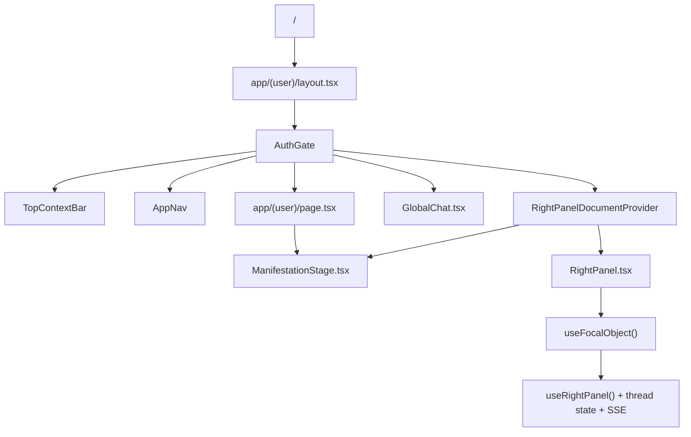

# Hearst OS

Système d'action centré chat avec orchestration v2, artifacts file-backed, et missions récurrentes.

> ✅ **Audit technique complet effectué le 21/04/2026** — Voir [AUDIT-REPORT.md](./AUDIT-REPORT.md)  
> Code mort supprimé (573 lignes), React hooks optimisés, logs debug nettoyés.  
> Application validée production-ready.

## Architecture UX

- **Chat global** (`GlobalChat`) — Input fixe en bas, context-aware. Pipeline v2 SSE par défaut (`/api/orchestrate`).
- **Right Panel** (`RightPanel` + `RightPanelDocumentProvider` dans `app/(user)/layout.tsx`) — Surface de confiance : missions, assets, stream. Machine à états INDEX/DOCUMENT (logique dans `RightPanel.tsx`). Quand le **focal** est `ready` ou `awaiting_approval` en mode DOCUMENT, le rendu `FocalObjectRenderer` part au **centre** (`ManifestationStage`) ; le rail reste en INDEX (pas de `<aside>`, fond `bg-background`).
- **Manifestation Stage** (`ManifestationStage` sur `/`) — Scène centrale (halo + textes) ; héberge aussi le document focal prêt (`FocalObjectRenderer` `surface="center"`). Dérivation `deriveManifestationVisualState` (focal > artifact > halo core > flowLabel faible). Overshoot React. Pas de CSS animé en boucle.
- **Halo runtime partagé** (`HaloRuntimeProvider` dans le layout user) — Un seul `useHalo` pour le bandeau d’orchestration et la scène centrale (même réduction SSE).
- **Surfaces** : `/` (home), `/inbox`, `/calendar`, `/files`, `/tasks`, `/apps`, `/admin/*`
- Layout user : sidebar icon-only (AppNav) + zone centrale + chat global + right panel

### Tokens (source `app/globals.css`)

Modèle d'élévation (du plus profond au plus clair) : **rail < background < surface**. Les panels sont *lifted* au-dessus du canvas pour être visibles sans OLED.

| Token | Var CSS | Hex | Usage |
|-------|---------|-----|-------|
| `bg-rail` | `--rail` | `#0c0c10` | Rail admin — `app/components/Sidebar.tsx` (`/admin/*`) |
| `bg-background` | `--background` | `#09090b` | Canvas — `body` (`app/layout.tsx`), `/login`, spinner d'`AuthGate` |
| `bg-surface` | `--surface` | `#14141a` | Panels lifted — `AppNav`, barre d'input `GlobalChat` (le rail droit utilise `bg-background`, pas `bg-surface`) |
| `bg-cyan-accent` / `text-cyan-accent` | `--cyan-accent` | `#00e5ff` | Accent unique (focal, dot connecté, divider) |
| `--glow-cyan-{sm,md,core,soft,dot}` | — | rgba(0,229,255,…) | Halos centralisés — **ne pas dupliquer en `rgba` dans les composants** |

Garde-fou : `__tests__/ui/design-tokens.test.ts` valide la présence de tous ces tokens dans `app/globals.css` et dans le bloc `@theme inline`.

#### Guide de style — mise à jour à prévoir (focal home / rail)

- **Deux surfaces** pour le contenu focal : `FocalObjectRenderer` avec `surface="rail"` conserve la coque verre (classe `.ghost-document-surface` dans `app/globals.css`) ; `surface="center"` évite cette coque pour que le document respire sur le fond de la scène (`ManifestationStage`).
- **Hiérarchie d’élévation** : le rail droit n’est plus un `<aside>` « lifted » `ghost-side-panel` ; il s’aligne sur le canvas (`bg-background`). Si le guide impose à nouveau un panel *surface* pour ce rail, mettre à jour la table tokens ci-dessus et `RightPanel.tsx` en cohérence.
- **État partagé** : toute évolution du flux INDEX/DOCUMENT ou d’un troisième emplacement de rendu doit rester sur `RightPanelDocumentProvider` + `useRightPanelDocument()` pour éviter des sources de vérité divergentes.

> Note : la palette `bg-zinc-{800,900,950}` reste utilisée volontairement dans `app/admin/*` et certaines pages `app/(user)/*` pour les **élévations multi-niveaux** (cartes, inputs, hovers, code blocks). Ces niveaux ne sont pas couverts par les 3 tokens canoniques ci-dessus.

#### Piège HMR connu — éditer `app/globals.css`

Next 16 + Turbopack peuvent garder en cache l'ancien contenu de `app/globals.css` après une édition de variables CSS dans `:root` ou `@theme`. Symptôme : le source contient `#050505` mais le navigateur sert encore `#000`. Ni `touch` ni hard reload ne suffisent.

Toujours faire après une édition de tokens :

```bash
npm run dev:fresh   # kill port 9000 + rm -rf .next + npm run dev
```

Vérification rapide depuis un terminal :

```bash
CSS=$(curl -s http://localhost:9000/login | grep -oE '/_next/static[^"]+\.css' | head -1)
curl -s "http://localhost:9000${CSS}" | grep -oE '\-\-(surface|background|rail|cyan-accent):[^;}]+' | sort -u
```

Les valeurs retournées doivent matcher exactement la table ci-dessus.

## Canonical UI Work Map

### Never Guess The Surface

Si un agent doit modifier l'UI HEARST OS, il doit partir de la chaîne réelle de rendu, pas d'une maquette statique.



### Work Here

- Centre home `/` : `app/(user)/page.tsx` + `app/components/system/ManifestationStage.tsx`
- Shell user réel : `app/(user)/layout.tsx`
- Sidebar gauche : `app/components/AppNav.tsx`
- Barre haute : `app/components/system/TopContextBar.tsx`
- Chat bas : `app/components/GlobalChat.tsx`
- Panneau droit : `app/components/right-panel/RightPanel.tsx` (export `RightPanelDocumentProvider`, hook `useRightPanelDocument`)
- Rendu d'objet focal : `app/components/right-panel/FocalObjectRenderer.tsx` (prop `surface`: `rail` = panneau verre `.ghost-document-surface`, `center` = home sans coque verre)
- État du panel/focal :
  - `app/hooks/use-right-panel.ts`
  - `app/hooks/use-focal-object.ts`
  - `app/hooks/use-sidebar.tsx`

### Do Not Work Here Unless Explicitly Asked

- maquettes HTML standalone
- fichiers de preview non branchés
- captures, prototypes, snippets jetables
- code runtime/orchestrator si la demande est purement visuelle

### Why Agents Get Confused

- `ManifestationStage` est réel, mais son rendu dépend du halo et du focal object ; en DOCUMENT focal prêt il consomme `useRightPanelDocument()` (même état que le rail)
- `RightPanel` dépend d'un thread actif, du polling `/api/v2/right-panel`, et des événements SSE
- `RightPanel` est masqué sous le breakpoint `lg`
- l'écran `/` passe d'abord par le shell authentifié, donc modifier un composant hors de cette chaîne ne change rien de visible

### Fast Validation Checklist

Avant toute conclusion du type "ça ne change pas", vérifier:

1. que le fichier modifié est bien dans la chaîne ci-dessus
2. que l'on teste la vraie route `/`
3. que la session est authentifiée
4. que la fenêtre est assez large pour afficher `RightPanel`
5. qu'on ne travaille pas sur une maquette hors circuit

### Anti-Mistake Rule

Si un agent ne peut pas relier visuellement un changement à `app/(user)/layout.tsx` ou à l'un des composants directement rendus depuis cette chaîne, il doit considérer qu'il est probablement en train d'éditer la mauvaise surface.

## Comportement produit

- **V2 Runtime** par défaut. V1 fallback via `NEXT_PUBLIC_USE_V2=false`.
- **Missions** : créées depuis le chat (CTA après report réussi) ou Right Panel. Composer inline, schedule presets, Run Now, toggle enable/disable.
- **Artifacts** : file-backed — PDF (pdfkit), XLSX (exceljs), markdown, JSON, CSV. Download via `/api/v2/assets/{id}/download`.
- **Connectors** : direct activation OAuth (Google, Slack). Vérité unifiée via `/api/v2/connectors/unified`.
- **Timeline** : observable dans le Right Panel, événements persistés via `/api/v2/runs/{id}`.
- **Inbox** : priorisation rule-based (urgent/normal/low), zéro LLM.

## Stack

- **Frontend** : Next.js 16 (App Router), React 19, Tailwind CSS, Geist
- **Backend** : Next.js API Routes, Zod validation, domain layer typé
- **Database** : Supabase (PostgreSQL), types auto-générés, pgvector
- **LLM** : Multi-provider (OpenAI, Anthropic, Composer 2, Gemini 3 Flash), smart routing, fallback `model_profiles`, cost tracking
- **Runtime** : Trace-first, lifecycle canonique, tool governance, replay (live/stub), cost sentinel, prompt guards, output validation
- **Intelligence** : Failure classification, tool/model scoring, drift detection, feedback signals
- **Décisions** : Tool/model selection, fallback intelligent, change tracking, operator surface
- **Deploy** : Vercel (frontend + API), Railway (Docker), standalone output

## Setup

```bash
# 1. Install
npm install

# 2. Config
cp .env.example .env.local
# Remplir : SUPABASE_URL, SUPABASE_ANON_KEY, SUPABASE_SERVICE_ROLE_KEY, OPENAI_API_KEY (et optionnellement COMPOSER_*, GEMINI_API_KEY — voir `.env.example`)

# 3. Database
npx supabase db push

# 4. Types (optionnel — régénérer depuis Supabase)
npx supabase gen types typescript --project-id <ref> > lib/database.types.ts

# 5. Dev
npm run dev  # http://localhost:9000

# 6. Tests
npm test     # 200 tests
```

## Architecture

```
lib/
├── database.types.ts        # Types auto-générés Supabase
├── supabase-server.ts       # Client serveur typé
├── domain/
│   ├── schemas.ts           # Validation Zod
│   ├── types.ts             # Types métier
│   ├── api-helpers.ts       # ok/err/parseBody/dbErr
│   └── slugify.ts
├── runtime/
│   ├── lifecycle.ts         # Statuses, transitions, erreurs typées, timeout, retry
│   ├── tracer.ts            # RunTracer: runs + traces + output validation auto
│   ├── tool-executor.ts     # HTTP tool execution + gouvernance complète
│   ├── workflow-engine.ts   # Versioned execution + smart tool/model selection
│   ├── memory-governor.ts   # TTL, dedup, max_entries, importance
│   ├── replay.ts            # Replay live/stub multi-step + comparaison
│   ├── cost-sentinel.ts     # Budget enforcement par run
│   ├── prompt-guard.ts      # Guards avancés + policies par agent
│   └── output-validator.ts  # Classification + trust scoring
├── integrations/
│   ├── adapter.ts           # IntegrationAdapter interface
│   ├── http-adapter.ts      # HTTP fetch (read-only)
│   ├── notion-adapter.ts    # Notion API (read-only)
│   ├── executor.ts          # Safe execution: tracer + retry + timeout + health
│   └── index.ts
├── analytics/
│   ├── failure-classifier.ts # 10 catégories d'échec déterministes
│   ├── metrics.ts            # Métriques tools + agents
│   ├── tool-ranking.ts       # Score, classement, drift detection
│   ├── feedback.ts           # Signaux d'amélioration
│   └── index.ts
├── decisions/
│   ├── tool-selector.ts      # Sélection par goal
│   ├── model-selector.ts     # Model scoring + goal-based selection
│   ├── smart-executor.ts     # Exécution avec fallback auto
│   ├── signal-manager.ts     # Lifecycle des improvement signals
│   ├── guard-advisor.ts      # Suggestion de guard_policy
│   ├── change-tracker.ts     # Audit trail: avant/après
│   └── index.ts
└── llm/
    ├── types.ts             # LLMProvider, ModelProfileConfig
    ├── router.ts            # getProvider, loadFallbackChain, smartChat…
    ├── openai.ts
    ├── anthropic.ts
    ├── composer.ts          # Cursor Composer 2 (OpenAI-compatible HTTP)
    └── gemini.ts            # Gemini API (gemini-3-flash-preview, …)
```

## API Routes

| Route | Méthode | Description |
|-------|---------|-------------|
| `/api/health` | GET | Health check (public) |
| `/api/agents` | GET/POST | Liste/création d'agents |
| `/api/agents/[id]` | GET/PUT/DELETE | CRUD agent |
| `/api/agents/[id]/chat` | POST | Chat streaming SSE tracé (opt-in smart routing) |
| `/api/agents/[id]/memory` | GET/POST | Mémoire agent |
| `/api/agents/[id]/memory/govern` | POST | Appliquer politique mémoire |
| `/api/agents/[id]/evaluate` | POST | Évaluation avec run tracé |
| `/api/agents/[id]/versions` | GET | Historique des versions |
| `/api/runs` | GET | Liste des runs (filtrable) |
| `/api/runs/[id]` | GET | Détail run + traces |
| `/api/runs/[id]/replay` | POST | Replay live/stub + comparaison |
| `/api/prompts` | GET/POST | Prompt artifact registry |
| `/api/prompts/[slug]` | GET | Versions d'un prompt |
| `/api/skills` | GET/POST | Catalogue skills |
| `/api/tools` | GET/POST | Catalogue tools |
| `/api/conversations` | GET/POST | Conversations |
| `/api/conversations/[id]/messages` | GET | Messages |
| `/api/workflows` | GET/POST | Workflows |
| `/api/workflows/[id]/run` | POST | Exécuter un workflow |
| `/api/workflows/[id]/publish` | POST | Publier version workflow |
| `/api/model-profiles` | GET/POST | Profils modèle |
| `/api/memory-policies` | GET/POST | Politiques mémoire |
| `/api/datasets` | GET/POST | Jeux de tests |
| `/api/datasets/[id]/entries` | GET/POST | Entrées dataset |
| `/api/datasets/[id]/evaluate` | POST | Batch eval |
| `/api/integrations` | GET/POST | Connexions + adapters |
| `/api/integrations/[id]/execute` | POST | Exécuter action (read-only) |
| `/api/integrations/[id]/health` | POST | Health check |
| `/api/analytics/tools` | GET | Métriques + ranking tools |
| `/api/analytics/agents` | GET | Métriques agents |
| `/api/analytics/models` | GET | Scoring + sélection modèles |
| `/api/analytics/generate` | POST | Générer improvement signals |
| `/api/signals` | GET | Liste signals (filtrable) |
| `/api/signals/[id]/resolve` | POST | Apply/dismiss/acknowledge + change tracking |
| `/api/changes` | GET | Audit trail des changements |
| `/api/cron/daily-report` | GET/POST | Cron daily crypto (scheduled, idempotent) |
| `/api/cron/market-watch` | GET/POST | Cron market watch (scheduled, idempotent) |
| `/api/cron/market-alert` | GET/POST | Cron market alert (conditional, 8h cooldown) |
| `/api/reports` | GET | Liste des rapports (filtre `type`, `status`) |
| `/api/reports/today` | GET | Statut du rapport du jour par type |
| `/api/reports/health` | GET | Health dashboard par type (streak, taux 14j) |

## Connectors (User Integrations)

Services connectés via OAuth, données réelles uniquement (zéro mock).

| Service | Provider | Scopes | Surface | Status |
|---------|----------|--------|---------|--------|
| Gmail | `google` | `gmail.readonly` | Inbox | Active |
| Google Calendar | `google` | `calendar.readonly` | Calendar | Active |
| Google Drive | `google` | `drive.readonly` | Files | Active |
| Slack | `slack` | `channels:read`, `channels:history`, `im:read`, `im:history`, `users:read`, `groups:*`, `mpim:*` | Inbox | Active (V1, lecture seule) |
| Tasks | — | — | Tasks | Non connecté |

Architecture : `lib/connectors/` (un connector par service), tokens chiffrés AES-256-GCM dans `user_tokens` (Supabase, RLS).

### Canonical APIs (v2)

| Route | Description |
|-------|-------------|
| `/api/orchestrate` | **Chat v2** — Pipeline SSE (Orchestrator → Plan → Agents) |
| `/api/v2/right-panel` | Agrégat UI (runs, assets, missions, connectors) |
| `/api/v2/runs`, `/api/v2/runs/{id}` | Runs v2 + timeline events |
| `/api/v2/assets/{id}`, `.../download` | Asset detail + file download |
| `/api/v2/missions`, `.../[id]/run` | CRUD missions + Run Now |
| `/api/v2/connectors/unified` | Reconciled connector view |
| `/api/v2/architecture` | Architecture map (admin) |

### Data APIs

| Route | Description |
|-------|-------------|
| `/api/gmail/messages` | Emails Gmail (lecture) |
| `/api/calendar/events` | Événements calendrier |
| `/api/files/list` | Fichiers Drive |
| `/api/slack/messages` | Messages Slack (lecture) |
| `/api/auth/slack` | OAuth Slack (redirect) |
| `/api/auth/callback/slack` | Callback OAuth Slack |

### Legacy APIs (kept for fallback, marked @deprecated)

| Route | Canonical replacement |
|-------|----------------------|
| `/api/chat` | `/api/orchestrate` |
| `/api/runs`, `/api/runs/{id}` | `/api/v2/runs` |
| `/api/connectors/status` | `/api/v2/connectors/unified` |
| `/api/missions/execute`, `/approve`, `/recent` | `/api/v2/missions` |

## Mission System

Architecture canonique pour les missions planifiées/autonomes.

| Layer | Path | Role |
|-------|------|------|
| Runtime (canonical) | `lib/runtime/missions/*` | Scheduler, store, lease, ops, types |
| Persistence | `lib/runtime/state/adapter.ts` | Supabase read/write (missions.actions jsonb) |
| APIs (canonical) | `/api/v2/missions`, `.../[id]/run`, `.../ops` | CRUD, Run Now, Ops status |
| Scheduler | `lib/runtime/missions/scheduler.ts` + `scheduler-init.ts` | Polling loop, leader lease, distributed dedup |
| UI client (canonical) | `app/lib/missions-v2.ts` | Frontend helpers (fetch, create, toggle, run) |
| Admin | `/admin/scheduler` | Leadership, ops table, run/toggle actions |
| Right Panel | `MissionsSection` + `MissionDetailSection` | Live status, schedule, errors |
| Legacy (deprecated) | `app/lib/missions/*` | Client-side mission engine — used by ControlPanel only |

## Auth

API key via `HEARST_API_KEY`. Quand elle est définie, `proxy.ts` (Next.js 16, équivalent middleware) applique la garde sur `/api/*` avec des exceptions explicites (`/api/health`, `/api/auth/*`). Une requête authentifiée (header `x-api-key` / `Authorization: Bearer`, ou cookie de session NextAuth) est acceptée. Si la variable est vide, la protection est désactivée — utile en dev, à éviter en prod (voir `.env.example`).

```bash
curl -H "x-api-key: YOUR_KEY" http://localhost:9000/api/agents
```

## Run Engine v2

Architecture multi-agents avec exécution déterministe et observable.

```
lib/
├── runtime/engine/
│   ├── types.ts              # EngineRun, RunStep, RunApproval, RunCost
│   ├── index.ts              # RunEngine façade (lifecycle, plan attachment)
│   ├── step-manager.ts       # CRUD + state transitions pour RunSteps
│   ├── approval-manager.ts   # Approval gates (create, decide, expire)
│   ├── artifact-manager.ts   # Artifacts CRUD + versioning
│   └── cost-tracker.ts       # Token/tool usage tracking
├── runtime/delegate/
│   ├── types.ts              # DelegateInput, DelegateResult union
│   ├── queue.ts              # DelegateJobQueue interface + factory
│   └── queue-memory.ts       # In-memory queue (dev/proto)
├── events/
│   ├── types.ts              # 25+ RunEvent types (discriminated union)
│   ├── bus.ts                # RunEventBus (pub/sub + buffer)
│   └── consumers/
│       ├── sse-adapter.ts    # Internal events → SSE for UI
│       └── log-persister.ts  # Persist errors/warnings to run_logs
├── plans/
│   ├── types.ts              # Plan, PlanStep, ActionPlan, ActionStep
│   └── store.ts              # PlanStore CRUD (dedicated tables)
├── artifacts/
│   ├── types.ts              # Artifact, ArtifactSection, ArtifactSourceRef
│   └── document-session.ts   # DocumentSession state machine (building→review→finalized)
└── agents/
    ├── doc-builder.ts        # DocBuilder agent (create_outline → generate_section → finalize)
    └── operator/
        ├── index.ts          # Exports publics
        ├── guard.ts          # Validation runtime tool calls vs ActionPlan
        └── executor.ts       # Exécution séquentielle + idempotency + action_executions
```

```
lib/orchestrator/
├── system-prompt.ts       # System prompt + tool definitions (create_plan, text_response)
├── planner.ts             # LLM call → Plan structuré ou réponse directe
├── executor.ts            # Exécute Plan steps via delegate() séquentiellement
└── index.ts               # orchestrate() → ReadableStream SSE
```

Migration : `supabase/migrations/0015_run_engine_v2.sql`

Run lifecycle : `created → running → completed | failed | cancelled | awaiting_approval | awaiting_clarification`

Coexiste avec le legacy `RunTracer` (`lib/runtime/tracer.ts`). Phase 1 utilise les deux.

## Database (32 tables, 15 migrations)

**Core** : agents, agent_versions, skills, skill_versions, tools, agent_skills, agent_tools
**Prompts** : prompt_artifacts (versioned, checksummed)
**Knowledge** : knowledge_bases, knowledge_documents, agent_knowledge
**Runtime** : runs, traces
**Conversations** : conversations, messages
**Observability** : evaluations, datasets, dataset_entries
**Configuration** : model_profiles, memory_policies
**Workflows** : workflows, workflow_steps, workflow_versions
**Memory** : agent_memory
**Integrations** : integration_connections
**Decisions** : improvement_signals, applied_changes
**Reports** : daily_reports (registry produit, idempotent)
**Missions** : missions, mission_runs (persistance des missions utilisateur + exécutions)
**Engine v2** : run_steps, run_approvals, run_logs, artifacts, artifact_versions, document_sessions, plans, plan_steps, action_plans, action_plan_steps, action_executions
**Legacy** : usage_logs, workflow_runs

## Runtime

```
pending → running → completed | failed | cancelled | timeout
```

Chaque run produit des traces granulaires : `llm_call`, `tool_call`, `memory_read`, `memory_write`, `condition_eval`, `custom`.

### Cost Sentinel
Budget par run, auto-injecté depuis `agents.cost_budget_per_run`. Warning à 80%, hard stop à 100%.

### Output Validation
Classification (`valid`/`invalid`/`suspect`), trust scoring, guards composables (JSON, taille, regex, blacklist). Branché dans le tracer — automatique pour chaque LLM call.

### Tool Governance
`kill_switch`, `risk_level`, `retry_policy`, `rate_limit`, `requires_sandbox`, per-agent overrides via `agent_tools`.

### Replay
Live (re-exécution réelle) ou stub (zero cost, outputs originaux). Config figée : agent_version, model_profile, prompt_artifact, workflow_version.

## Smart Routing (opt-in)

### Tool Selection
```bash
# Workflow avec smart tool fallback
POST /api/workflows/{id}/run
{ "input": {...}, "smart_tool_selection": true }
```

### Model Selection
```bash
# Chat avec smart model routing
POST /api/agents/{id}/chat
{ "message": "...", "smart_routing": true, "model_goal": "reliability" }
```

Goals : `reliability` | `speed` | `cost` | `balanced`

Chaque décision est tracée : `model_selection` (score, reason, was_overridden), `model_fallback` (erreur source, fallback_to). Le modèle original de l'agent est toujours en dernier recours.

## Operator Surface

- **`/signals`** : console de signaux filtrable (priorité, status, type), acknowledge/apply/dismiss
- **`/changes`** : audit trail des décisions appliquées, diff avant/après

## Tests

```bash
npm test  # 200 tests, 17 fichiers
```

Couverture : lifecycle, cost sentinel, prompt guards, output validator, tracer integration, adapters, executor, failure classifier, tool ranking, feedback, tool selector, signal manager, model selector, change tracker, smart router, 6 scénarios end-to-end.

### Scénarios end-to-end

| Scénario | Vérifie |
|----------|---------|
| Tool failure + fallback | Détection, classification, fallback tracé, signal généré |
| Cost limit hard stop | Warning 80%, COST_LIMIT_EXCEEDED, classification critical |
| Guard failure strict | Blacklist + taille, trust guard_failed, no crash |
| Model routing + fallback | Sélection, was_overridden, traces decision + fallback |
| Full workflow E2E | Multi-step, cost accumulation, stub replay zero cost |
| Drift detection | success_rate drop, latency spike, signal tool_replacement |

## Report Capabilities (Cron Production)

Infrastructure partagée (`lib/runtime/report-runner.ts`) pour toutes les capabilities de reporting.

### Architecture d'exécution

| Rôle | Responsable | Notes |
|------|-------------|-------|
| Runtime + Cron | **Railway** | Source unique d'exécution des reports |
| Frontend / UI | **Vercel** | Console opérateur et API lecture |

**Railway est le cron owner.** Pas de crons définis dans `vercel.json`.
Un seul runtime exécute les workflows pour éviter doublons et fragmentation.

### Reports actifs

| Report | Type | Cron Railway | Endpoint | Env var | Mode |
|--------|------|-------------|----------|---------|------|
| Daily Crypto Report | `crypto_daily` | 7h UTC | `/api/cron/daily-report` | `DAILY_REPORT_WORKFLOW_ID` | Scheduled |
| Market Watch Report | `market_watch` | 8h UTC | `/api/cron/market-watch` | `MARKET_WATCH_WORKFLOW_ID` | Scheduled |
| Market Alert | `market_alert` | `*/4h` UTC | `/api/cron/market-alert` | `MARKET_ALERT_WORKFLOW_ID` | Conditional |

### Authentification

**Obligatoire.** Tout appel sans `CRON_SECRET` est rejeté (401).

```bash
curl -X GET https://hearst-agents-production.up.railway.app/api/cron/daily-report \
  -H "Authorization: Bearer $CRON_SECRET"
```

Variables requises : `CRON_SECRET`, `DAILY_REPORT_WORKFLOW_ID`, `MARKET_WATCH_WORKFLOW_ID`, `MARKET_ALERT_WORKFLOW_ID`.
Variable optionnelle : `ALERT_WEBHOOK_URL` (Discord/Slack webhook pour alertes échec).

### Idempotence (reports programmés)

Un seul rapport `completed` par date UTC + type (index unique conditionnel sur `daily_reports`).
S'applique à `crypto_daily` et `market_watch`.

| Situation | Comportement |
|-----------|-------------|
| Aucun rapport pour la date | Exécution normale |
| Rapport `completed` | Skip (`already_ran`) |
| Rapport `running` | Skip |
| Rapport `failed` | Retry automatique |
| Rapport `completed` + `force: true` | Force rerun |

### Relance manuelle

```bash
# Retry du jour
curl -X POST https://hearst-agents-production.up.railway.app/api/cron/daily-report \
  -H "Authorization: Bearer $CRON_SECRET" \
  -H "Content-Type: application/json" \
  -d '{"triggered_by": "manual", "reason": "Relance après fix"}'

# Date spécifique
curl -X POST https://hearst-agents-production.up.railway.app/api/cron/market-watch \
  -H "Authorization: Bearer $CRON_SECRET" \
  -H "Content-Type: application/json" \
  -d '{"date": "2026-04-17", "triggered_by": "manual", "reason": "Rapport manqué"}'

# Force rerun
curl -X POST https://hearst-agents-production.up.railway.app/api/cron/daily-report \
  -H "Authorization: Bearer $CRON_SECRET" \
  -H "Content-Type: application/json" \
  -d '{"force": true, "triggered_by": "manual", "reason": "Données corrigées"}'
```

### Market Alert — Exécution conditionnelle

Le Market Alert est différent des reports programmés :
- **Fréquence** : toutes les 4h (6x/jour)
- **Conditionnel** : ne produit un rapport que si des signaux significatifs sont détectés
- **Cooldown** : 8h entre deux reports `completed` (pas de spam)
- **No signal** : si rien de notable → `status = skipped`, `idempotency_decision = no_signal`

#### Signal types

| Signal | Condition déclenchante | Sévérité |
|--------|----------------------|----------|
| `flash_move` | Variation 24h > ±10% sur un top-50 coin | `critical` |
| `volume_spike` | Volume exchange significativement au-dessus de la normale | `warning` |
| `new_trending` | Coin trending qui n'apparaissait pas récemment | `info` |
| `defi_stress` | Variation TVL DeFi > ±8% en 24h | `warning` |

#### Sévérité

Déterminée par les signaux détectés, pas par le LLM :
- `critical` : `flash_move` présent
- `warning` : `defi_stress` ou `volume_spike` présent
- `info` : `new_trending` uniquement

#### Cooldown

- Fenêtre de 8h : pas de nouveau report `completed` ou `running` dans la fenêtre
- Si un report a été produit il y a < 8h → `cooldown_blocked`
- `force: true` permet de bypasser le cooldown

#### Test manuel

```bash
# Déclencher un scan
curl -X GET https://hearst-agents-production.up.railway.app/api/cron/market-alert \
  -H "Authorization: Bearer $CRON_SECRET"

# Force rerun (bypass cooldown)
curl -X POST https://hearst-agents-production.up.railway.app/api/cron/market-alert \
  -H "Authorization: Bearer $CRON_SECRET" \
  -H "Content-Type: application/json" \
  -d '{"force": true, "triggered_by": "manual", "reason": "Test signal detection"}'
```

#### Webhook

L'alerting webhook est envoyé **uniquement quand un signal réel est détecté** (report `completed`).
Aucune notification pour `no_signal` ou `cooldown_blocked`.
Le message inclut la sévérité et les signal types détectés.

### Registry (`daily_reports`)

Chaque rapport est un **objet produit** séparé du run technique :

| Champ | Description |
|-------|-------------|
| `report_date` | Date UTC du rapport |
| `report_type` | `crypto_daily` / `market_watch` / `market_alert` |
| `run_id` | Lien vers le run source |
| `status` | `pending` / `running` / `completed` / `failed` / `skipped` |
| `content_markdown` | Rapport complet (null si `skipped`) |
| `summary` | Résumé (préfixé `[SEVERITY]` pour alertes) |
| `highlights` | Points clés + métadonnées (`severity: X`, `signal_types: Y`) |
| `error_message` | Cause d'échec / raison rerun |
| `triggered_by` | `cron` / `manual` |
| `idempotency_decision` | `run` / `retry` / `skip` / `no_signal` / `cooldown_passed` |

### Alerting

**Échecs** : Log structuré `[cron/{type}] [ALERT]` + webhook si configuré.
**Alertes marché** : Webhook avec sévérité + signaux détectés (uniquement si signal réel).
Aucune notification pour `no_signal`.

### Visibilité opérateur

| Endpoint | Description |
|----------|-------------|
| `GET /api/reports?type=X` | Liste paginée (filtre `type`, `status`) |
| `GET /api/reports/today?type=X` | Statut du jour + dernier succès |
| `GET /api/reports/health?type=X` | Dashboard santé (streak, taux 14j, dernier échec) |
| `/reports` | Console opérateur (health multi-type, filtre, détails) |

### Investigation d'un échec

| Étape | Action |
|-------|--------|
| 1 | `GET /api/reports/today?type=X` → `status` + `error_message` |
| 2 | `GET /api/reports/health?type=X` → streak cassé ? taux en baisse ? |
| 3 | `GET /api/runs/{run_id}` → traces (tool calls, LLM, erreurs) |
| 4 | Logs Railway → chercher `[cron/{type}]` |
| 5 | Relancer → `POST /api/cron/{name}` avec auth + reason |

### Ajouter un nouveau type de report (spec canonique)

Toute nouvelle capability doit suivre ce pattern exact. Un 3e report est **un fichier de ~30 lignes**.

**Prérequis obligatoires** :

| Élément | Obligatoire | Fourni par |
|---------|:-----------:|------------|
| Agent dédié (system prompt spécifique) | Oui | Créer via `/api/agents` |
| Workflow (tools → collect → template → chat) | Oui | Créer via `/api/workflows` + steps Supabase |
| Endpoint cron `app/api/cron/{name}/route.ts` | Oui | ~30 lignes, wrapper `report-runner.ts` |
| `ReportConfig` dans l'endpoint | Oui | `reportType`, `label`, `workflowIdEnvVar`, `workflowNamePattern`, `missionLabel` |
| Env var `{NAME}_WORKFLOW_ID` sur Railway | Oui | Dashboard Railway |
| Entrée dans le README (table "Reports actifs") | Oui | Manuel |

**Ce qui est automatique** (hérité de `report-runner.ts`) :
- Auth cron (`CRON_SECRET`)
- Idempotence quotidienne (registry `daily_reports`)
- Alerting webhook
- Report extraction (content, summary, highlights)
- Visibilité opérateur (APIs + UI `/reports`)

**Checklist de validation** :

1. `GET /api/cron/{name}` avec auth → `completed`
2. 2e appel → `already_ran` (idempotence)
3. `GET /api/reports/today?type={type}` → rapport visible
4. `GET /api/reports/health?type={type}` → streak = 1
5. UI `/reports` → rapport visible avec badge type + détails

**Template endpoint cron** :

```typescript
import { NextRequest } from "next/server";
import { err } from "@/lib/domain";
import { authenticateCron, runReport, parseCronBody, type ReportConfig } from "@/lib/runtime/report-runner";

export const dynamic = "force-dynamic";
export const maxDuration = 120;

const CONFIG: ReportConfig = {
  reportType: "your_type",
  label: "Your Report Label",
  workflowIdEnvVar: "YOUR_TYPE_WORKFLOW_ID",
  workflowNamePattern: "your%pattern",
  missionLabel: "Your Mission Label",
};

export async function GET(req: NextRequest) {
  const auth = authenticateCron(req.headers.get("authorization"), `cron/${CONFIG.reportType}`, req.headers.get("x-forwarded-for") ?? "unknown");
  if (!auth.ok) return err(auth.reason, 401);
  return runReport(CONFIG, "cron");
}

export async function POST(req: NextRequest) {
  const auth = authenticateCron(req.headers.get("authorization"), `cron/${CONFIG.reportType}`, req.headers.get("x-forwarded-for") ?? "unknown");
  if (!auth.ok) return err(auth.reason, 401);
  let body: unknown = null;
  try { body = await req.json(); } catch { /* ok */ }
  const p = body ? parseCronBody(body) : { triggeredBy: "manual", forceRerun: false };
  return runReport(CONFIG, p.triggeredBy, p.dateOverride, p.rerunReason, p.forceRerun);
}
```

## Deploy

```bash
# Vercel
vercel --prod

# Docker / Railway
docker build -t hearst-agents .
docker run -p 9000:3000 --env-file .env.local hearst-agents
```

## Scripts

| Commande | Description |
|----------|-------------|
| `npm run dev` | Serveur dev (port 9000) |
| `npm run build` | Build production |
| `npm start` | Serveur production |
| `npm run lint` | ESLint (0 erreur ; des warnings peuvent rester) |
| `npm test` | Tests (vitest) |
| `npm run test:watch` | Tests en watch mode |
